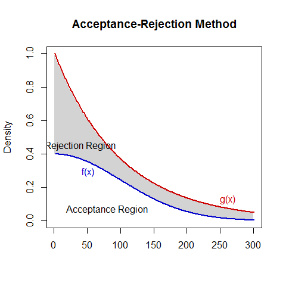

[](http://quantlet.de/)

## [](http://quantlet.de/) **BCS_ARM** [](http://quantlet.de/)

```yaml


Name of Quantlet:    'BCS_ARM'

Published in:        'Basic Elements of Computational Statistics'

Description:         'This Quantlet produces a plot showing the acceptance
                      rejection method for pseudo genrated random variable. It is used to
                      consider whether an observation belongs to one or another distribution.'

Keywords:            'accepatence region, pseudo generated, random, plot, distribution'

Author[New]:          Martin Schelisch

Submitted:           '2016-01-28, Christoph Schult'

```



### R Code
```r

# create data to plot
x = seq(0, 3, 0.01)
z = dnorm(seq(0, 3, 0.01))
y = dexp(seq(0, 3, 0.01))

plot(z, type = "l", lwd = 2, ylim = c(0, 1), main = "Acceptance-Rejection Method", xlab = "", ylab = "Density")

# shaded areas to illustrate the accepatence and rejection region
polygon(c(x * 100, 300, 0), c(y, 0, 0), col = "lightgrey", border = "white", fillOddEven = T)
polygon(c(x * 100, 300, 0), c(z, 0, 0), col = "white", border = "white")

# borders of regions
lines(z, type = "l", lwd = 2, col = "blue3")
lines(y, type = "l", lwd = 2, col = "red3")

# add legend to plot
text(250, 0.11, "g(x)", adj = c(0, 0), col = "red3")
text(42, 0.32, "f(x)", adj = c(0, 1), col = "blue3")
text(80, 0.07, "Acceptance Region")
text(40, 0.45, "Rejection Region")
```

automatically created on 2023-03-28