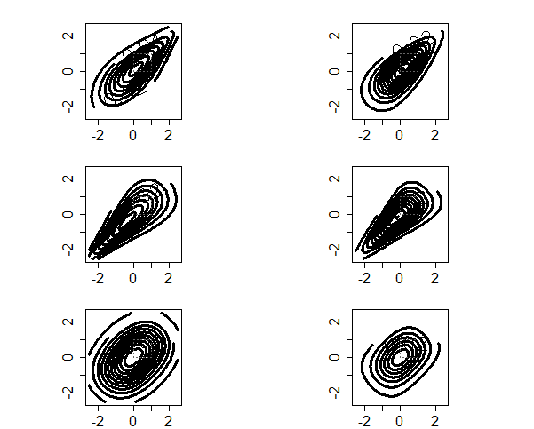

[](http://quantlet.de/)

## [](http://quantlet.de/) **BCS_ArchimedeanContour** [](http://quantlet.de/)

```yaml

Name of Quantlet : BCS_ArchimedeanContour

Published in : Basic Elements of Computational Statistics

Description : 'Nine Plots are created for three different archimedean copulae with the same
dependency parameter (theta=2). The figures in the left column are created based on normal marginal
distributions. In the right column all copulae are based on a t-distribution with six degrees of
freedom. The rows depict the Gumbel, Clayton and Frank copulae in descending order.'

Keywords : multivariate,copula,archimedean,frank,gumbel,clayton,normal, student,distribution

Author : Ostap Okhrin

Submitted : 2016-01-28, Christoph Schult

Output : Nine contour plots for different bivariate archimedean copulae and marginal distributions.

```




### R Code:
```r
library(copula)

graphics.off()
layout(matrix(c(1, 2, 3, 4, 5, 6), 3, 2, byrow = TRUE))  # defines number of plots and their respective positions
par(pty = "s", mar = c(2.1, 2.5, 2.1, 2.5))  # graphical parameters see ?par()

# Gumbel Copulae with theta=2

# Gumbel Copula for normal marginal distributions
gumMVD = mvdc(gumbelCopula(2), margins = c("norm", "norm"), paramMargins = list(list(mean = 0, sd = 1.2), list(mean = 0, 
    sd = 1.2)))  # marginal distribution parameters

# Contour Plot: Gumbel Copula based on normal marginal distributions
contour(gumMVD, dMvdc, xlim = c(-2.5, 2.5), ylim = c(-2.5, 2.5), cex.axis = 1.5, labcex = 1.5, lwd = 3)  # random variables


# Gumbel Copula for t6 marginal distributions
gumMVD = mvdc(gumbelCopula(2), margins = c("t", "t"), paramMargins = list(list(df = 6), list(df = 6)))  # marginal distribution parameter

# Contour Plot: Gumbel Copula based on t6 marginal distributions
contour(gumMVD, dMvdc, xlim = c(-2.5, 2.5), ylim = c(-2.5, 2.5), cex.axis = 1.5, labcex = 1.5, lwd = 3)

# Clayton Copulae theta=2

# Clayton Copula for normal marginal distributions
clayMVD = mvdc(claytonCopula(2), margins = c("norm", "norm"), paramMargins = list(list(mean = 0, sd = 1.2), list(mean = 0, 
    sd = 1.2)))

# Contour Plot: Clayton Copula for normal marginal distributions
contour(clayMVD, dMvdc, xlim = c(-2.5, 2.5), ylim = c(-2.5, 2.5), cex.axis = 1.5, labcex = 1.5, lwd = 3)

# Clayton Copula for t6 marginal distributions
clayMVD = mvdc(claytonCopula(2), margins = c("t", "t"), paramMargins = list(list(df = 6), list(df = 6)))

# Contour Plot: Clayton Copula for t6 marginal distributions
contour(clayMVD, dMvdc, xlim = c(-2.5, 2.5), ylim = c(-2.5, 2.5), cex.axis = 1.5, labcex = 1.5, lwd = 3)

# Frank Copulae theta=2

# Frank Copula for normal marginal distributions
frankMVD = mvdc(frankCopula(2), margins = c("norm", "norm"), paramMargins = list(list(mean = 0, sd = 1.2), list(mean = 0, 
    sd = 1.2)))

# Contour Plot: Frank Copula for normal marginal distributions
contour(frankMVD, dMvdc, xlim = c(-2.5, 2.5), ylim = c(-2.5, 2.5), nlevels = 10, cex.axis = 1.5, labcex = 1.5, lwd = 3)

# Frank Copula for t6 marginal distributions
frankMVD = mvdc(frankCopula(2), margins = c("t", "t"), paramMargins = list(list(df = 6), list(df = 6)))

# Contour Plot: Frank Copula for t6 marginal distributions
contour(frankMVD, dMvdc, xlim = c(-2.5, 2.5), ylim = c(-2.5, 2.5), nlevels = 10, cex.axis = 1.5, labcex = 1.5, lwd = 3)

```
