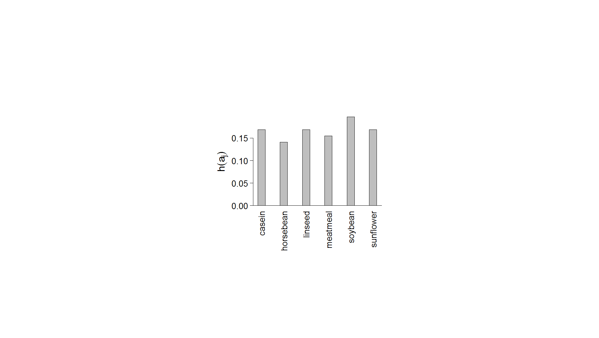
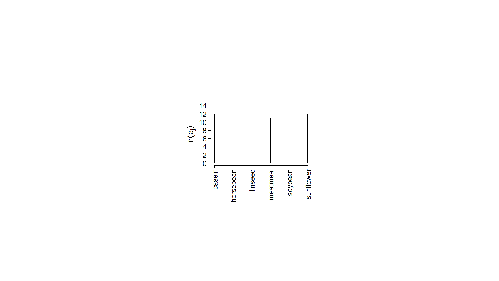

[](http://quantlet.de/)

## [](http://quantlet.de/) **BCS_BarGraphs** [](http://quantlet.de/)

```yaml


Name of Quantlet:      'BCS_BarGraphs'
 
Published in:          'Basic Elements of Computational Statistics'

Description:           'Bar diagram and plot of relative frequencies of the R data subset
                       "chickwts$feed". It is an efficient way of plotting the frequencies of
                        discreet variables, particularly useful to illustrate the behaviour (variation)
                        over time.'
  
Keywords:              'data visualization, distribution, graphical representation, plot, visualization'
     
See also:              'BCS_BarGraphs, BCS_Boxplot, BCS_Boxplot2, BCS_ecdf, BCS_hist1, BCS_hist2'

Author[New]:           Gunawan

Submitted:             '2016-01-28, Christoph Schult'
     
Output:                'Bar diagram and plot of chickwts in .pdf format.'


```





### R Code
```r

# cex for axis label size, margins (bottom, left, top, right) fin for figure dimension region (width and height), mgp
# for the positions of axis las for label axis style = 2 (always perpendicular to the axis)
par(cex.axis = 1.7, mai = c(b = 0.5, l = 1.2, t = 0.01, r = 0.01), fin = c(w = 5.5, h = 3.5), mgp = c(4, 0.8, 0), las = 2)

# Bar Plot with axis label size=2, space between bars equal 2
barplot(table(chickwts$feed)/length(chickwts$feed), space = 2, ylab = expression(h(a[j])), xlab = "", cex.lab = 2)
abline(h = 0)

# cex for axis label size, margins (bottom, left, top, right) fin for figure dimension region (width and height), mgp
# for the positions of axis las for label axis style = 2 (always perpendicular to the axis)
par(cex.axis = 1.7, mai = c(b = 0.5, l = 0.95, t = 0.01, r = 0.01), fin = c(w = 5, h = 3), mgp = c(2.8, 0.8, 0), las = 2)

# Bar Diagram with axis label size=2
plot(table(chickwts$feed), ylab = expression(h(a[j])), xlab = "", cex.lab = 2)

```

automatically created on 2023-03-28