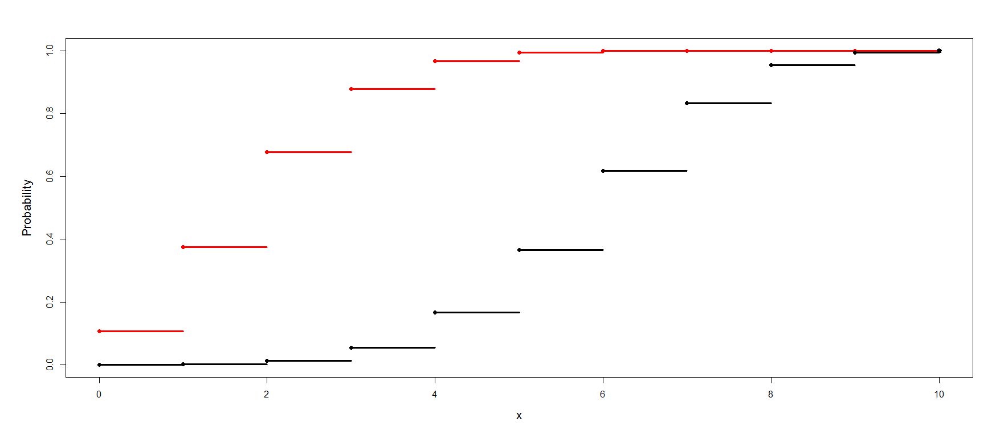

[](http://quantlet.de/)

## [](http://quantlet.de/) **BCS_Bincdf** [](http://quantlet.de/)

```yaml


Name of Quantlet:        'BCS_Bincdf'

Published in:            'Basic Elements of Computational Statistics'
   
Description:             'Graphic of the binomial cumulative distribution function
                          with observations n = 10 and two different probabilities for the event,
                          p = 0.2 (black) and p = 0.6 (red).'
 
Keywords:                'binomial, cdf, distribution, plot, visualization'

See also:                 BCS_Binhist, BCS_Binhyper, BCS_Binnorm, BCS_Binompdf, BCS_Binpdf

Author:                   Johannes Haupt
         

Submitted:               '2016-01-28, Christoph Schult'

Output:                  'Graphic of the binomial cdf with n = 10, p = 0.2 (black) and p = 0.6 (red)'

```



### R Code
```r

# create a function to draw a binomial cdf

create.binomial.cdf = function(N, p, colour = "black", pch = 16) {
    n = max(length(N), length(p), length(colour), length(pch))
    N = rep(N, length = n)
    p = rep(p, length = n)
    colour = rep(colour, length = n)
    pch = rep(pch, length = n)
    
    add.one.series = function(N, p, colour, pch, maxN) {
        cdf = pbinom(0:N, N, p)
        # lines(0:N, cdf, type='s', col=colour)
        for (i in 1:N) lines(c(i - 1, i), c(cdf[i], cdf[i]), type = "s", col = colour, lwd = 3)
        lines(c(N, maxN), c(1, 1), type = "b", col = colour, lwd = 3)
        
        points(0:N, cdf, col = colour, pch = pch)
    }
    
    # par(lwd=1.5, cex=1, mar=c(3.1,2.5,0.5,0.5))
    plot(1, xlim = c(0, max(N)), ylim = c(0, 1), type = "n", xlab = "x", ylab = "Probability")
    for (i in 1:n) add.one.series(N[i], p[i], colour[i], pch[i], max(N))
}

# setting up the axis label size and margin (bottom, left, top, right)
par(cex.lab = 1.3, mai = c(b = 1.2, l = 1.2, t = 0.7, r = 0.5))
# run the function
create.binomial.cdf(c(10, 10), c(0.2, 0.6), c("red", "black"))
```

automatically created on 2023-03-28