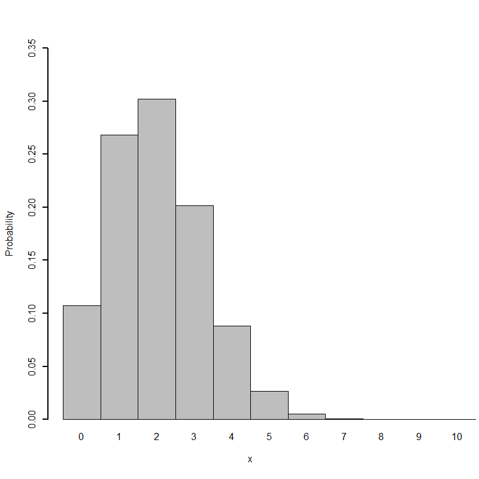

[](http://quantlet.de/)

## [](http://quantlet.de/) **BCS_Binhist** [](http://quantlet.de/)

```yaml


Name of Quantlet:     'BCS_Binhist'
   
Published in:         'Basic Elements of Computational Statistics'
 
Description:          'Probability Mass Function of the binomial distribution with
                       number of trials n = 10 and probability of success p = 0.2'
 
Keywords:             'binomial, discrete, distribution, plot, visualization'

See also:             'BCS_Bincdf, BCS_Binhyper, BCS_Binnorm, BCS_Binompdf, BCS_Binpdf, 
                       BCS_Binpois'

Author:               'Johannes Haupt'

Submitted:            '2016-01-28, Christoph Schult'

Output:               'Diagram of the probability mass function.'

```



### R Code
```r

# define plot paramters
par(cex = 1.3, mar = c(5, 4, 4, 2) + 0.3)
# define a function hist.binom that plots a histogram of the binomial distribution dbinom is the function to create
# the binomial distribution using size n and prob p
hist.binom = function(n, p, color = 0) {
    x = 0:n
    p = dbinom(x, n, p)
    names(p) = as.character(0:n)
    
    barplot(p, space = 0, ylim = c(0, 0.35), xlim = c(0, n), lwd = 2, col = "grey", xlab = "x", ylab = "Probability")
}
hist.binom(10, 0.2)
```

automatically created on 2023-03-27