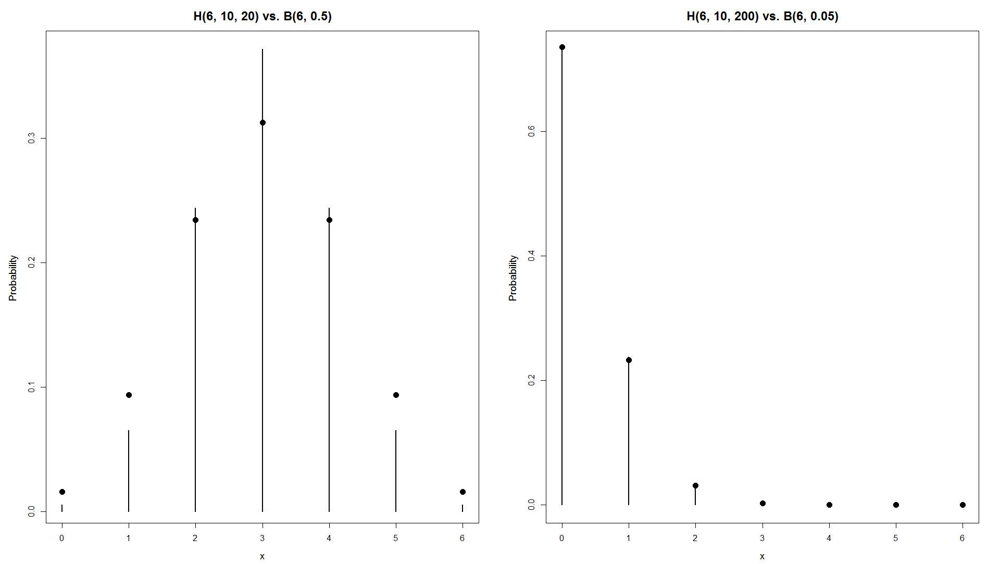

[](http://quantlet.de/)

## [](http://quantlet.de/) **BCS_Binhyper** [](http://quantlet.de/)

```yaml


Name of Quantlet:       'BCS_Binhyper'
 
Published in:           'Basic Elements of Computational Statistics'

Description:            'Two plots of the probability functions of the hypergeometric
                         distribution (plotted as lines) vs. the binomial distribution (plotted as dots).
                         The binomial distribution is a limiting form of the hypergeometric distribution,
                         for sample sizes much smaller than population size. In that case, the binomial
                         distribution can be used to approximate the hypergeometric distribution.'

Keywords:               'approximation, binomial, distribution, plot, visualization'

See also:               BCS_Bincdf, BCS_Binhist, BCS_Binompdf

Author[New]:            Johannes Haupt

Submitted:              '2016-01-28, Christoph Schult'

Output:                 'Graphic of probability functions of the hypergeometric (lines) vs.
                         binomial distribution (dots)'

```



### R Code
```r

# setting up the axis label size and margin (bottom, left, top, right)
par(cex.lab = 1.2, cex.main = 1.5, mar = c(4, 4.5, 3, 2) + 0.1, mgp = c(2.8, 1, 0), mfrow = c(1, 2))

# set the values
m = 10
x = 2
N = 20
n = 6
# dhyper(x,m,N-m,n)

# Plot the two functions on the left

plot(0:6, dhyper(0:6, 10, 10, 6), type = "h", lwd = 2, xlab = "x", ylab = "Probability ", main = "H(6, 10, 20) vs. B(6, 0.5)")
points(0:6, dbinom(0:6, 6, 0.5), pch = 16, cex = 1.5, col = "black")

# Plot the two functions on the right

plot(0:6, dhyper(0:6, 10, 190, 6), type = "h", lwd = 2, xlab = "x", ylab = "Probability ", main = "H(6, 10, 200) vs. B(6, 0.05)")
points(0:6, dbinom(0:6, 6, 0.05), pch = 16, cex = 1.5, col = "black")
```

automatically created on 2023-03-27