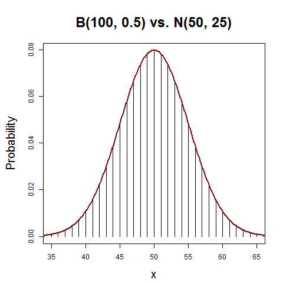

[](http://quantlet.de/index.php?p=info)

## [](http://quantlet.de/) **BCS_Binnorm** [](http://quantlet.de/d3/ia)

```yaml

Name of Quantlet : BCS_Binnorm

Published in : Basic Elements of Computational Statistics

Description : 'Graphic of the Probability Mass Function of a binomial distribution vs. normal
distribution. The binomial is given by bars, while the normal distr. is plotted as a red line. It
can be seen that the binomial closely approaches the normal distribution for the specified values.'

Keywords : 'approximation, binomial, normal, normal approximation, normal-distribution, plot,
visualization'

See also : BCS_Bincdf, BCS_Binhist, BCS_Binompdf, BCS_Binpois, BCS_NormPdfCdf

Author[New] : Johannes Haupt

Submitted : 2016-01-28, Christoph Schult

Output : Graphic of the Probability Mass Function of binomial distribution vs. normal distribution

```




```r
# setting up the axis label size and margin (bottom, left, top, right)

par(cex.lab = 1.7, cex.main = 2, mar = c(4.5, 5, 5, 2) + 0.1, mgp = c(3.2, 1, 0))

# set the values
n = 100
p = 0.5
s = 0:n

# Create a binomial distribution and plot it in lines
f = dbinom(x = s, n, p)
plot(s, f, type = "h", xlab = "x", ylab = "Probability", main = "B(100, 0.5) vs. N(50, 25)", xlim = c(35, 65))

# Create a normal distribution and add it to the plot in red
x = seq(1, n, length = 1000)
norm = dnorm(x, mean = 50, sd = 5)

lines(x, norm, col = "dark red", lwd = 2) 
```
