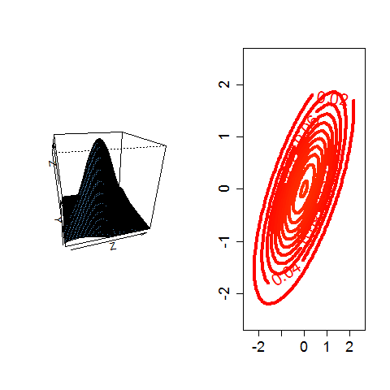

[](http://quantlet.de/index.php?p=info)

## [](http://quantlet.de/) **BCS_NormalDensity** [](http://quantlet.de/d3/ia)

```yaml

Name of Quantlet : BCS_NormalDensity

Published in : Basic Elements of Computational Statistics

Description : 'The code creates two graphics. One graphic is a scatterplot of the bivariate normal
distribution. Contours are plotted to illustrate for which combinations of the two variables the
density function is the same. You can call them also isolines. The other plot is a 3 dimensional
scatterplot, which shows the specific value of the joint pdf. It looks like a mountain. The highest
point is the expectation.'

Keywords : 'multivariate,distribution,normal,density,pdf,multivariate,contour,
eigenvalues,standard,gaussian,copula,gaussian'

Author : Ostap Okhrin

Submitted : 2016-01-28, Christoph Schult

Output : 3D-scatterplot for bivariate normal distribution and contour plot.

```




```r

```
