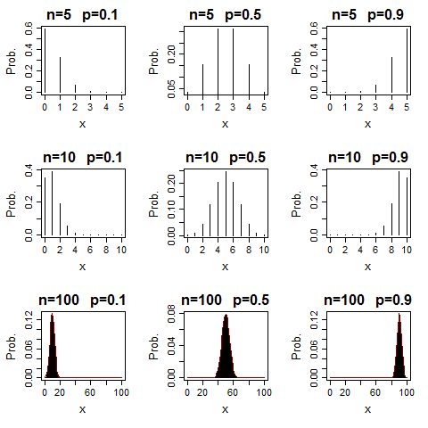

[](http://quantlet.de/index.php?p=info)

## [](http://quantlet.de/) **BCS_Binpdf** [](http://quantlet.de/d3/ia)

```yaml

Name of Quantlet : BCS_Binpdf

Published in : Basic Elements of Computational Statistics

Description : 'The binomial distribution is plotted for sample sizes 5, 10 and 100 and
probabilities 0.1, 0.5 and 0.9. The plots show nicely the shape of the pdf for the different values
and show when it can likely be approximated by the normal distribution.'

Keywords : approximation, binomial, distribution, graphical representation, pdf, visualization

See also : BCS_Bincdf, BCS_Binhist, BCS_Binompdf

Author : [New] Johannes Haupt

Submitted : 2016-01-28, Christoph Schult

Output : BCS_Bincdf, BCS_Binhist, BCS_Binompdf

```




```r
# setting up the axis label size and margin (bottom, left, top, right)
par(cex.lab = 1.7, mar = c(5.5, 4.8, 3, 2) + 0.1, mgp = c(3, 1, 0), mfrow = c(2, 2), cex.main = (2), cex.axis = 1.4, 
    mfrow = c(3, 3))


# plots for n=5 and different p
n = 5
s = 0:n
p = 0.1
f = dbinom(x = s, n, p)
plot(s, f, type = "h", main = "n=5   p=0.1", xlab = "x", ylab = "Prob.")

n = 5
s = 0:n
p = 0.5
f = dbinom(x = s, n, p)
plot(s, f, type = "h", main = "n=5   p=0.5", xlab = "x", ylab = "Prob.")

n = 5
s = 0:n
p = 0.9
f = dbinom(x = s, n, p)
plot(s, f, type = "h", main = "n=5   p=0.9", xlab = "x", ylab = "Prob.")

### plots for n=10 and different p
n = 10
s = 0:n
p = 0.1
f = dbinom(x = s, n, p)
plot(s, f, type = "h", main = "n=10   p=0.1", xlab = "x", ylab = "Prob.")

n = 10
s = 0:n
p = 0.5
f = dbinom(x = s, n, p)
plot(s, f, type = "h", main = "n=10   p=0.5", xlab = "x", ylab = "Prob.")

n = 10
s = 0:n
p = 0.9
f = dbinom(x = s, n, p)
plot(s, f, type = "h", main = "n=10   p=0.9", xlab = "x", ylab = "Prob.")

### plots for n=100 and different p
n = 100
s = 0:n
p = 0.1
f = dbinom(x = s, n, p)
plot(s, f, type = "h", main = "n=100   p=0.1", xlab = "x", ylab = "Prob.")
norm = dnorm(x = s, 10, 3)
lines(x = s, norm, col = "dark red")

n = 100
s = 0:n
p = 0.5
f = dbinom(x = s, n, p)
plot(s, f, type = "h", main = "n=100   p=0.5", xlab = "x", ylab = "Prob.")
norm = dnorm(x = s, 50, 5)
lines(x = s, norm, col = "dark red")

n = 100
s = 0:n
p = 0.9
f = dbinom(x = s, n, p)
plot(s, f, type = "h", main = "n=100   p=0.9", xlab = "x", ylab = "Prob.")
norm = dnorm(x = s, 90, 3)
lines(x = s, norm, col = "dark red")
```
