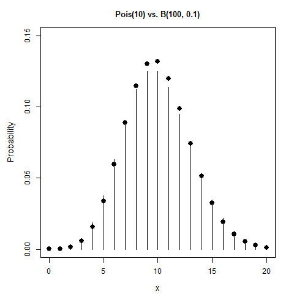

[](http://quantlet.de/)

## [](http://quantlet.de/) **BCS_Binpois** [](http://quantlet.de/)

```yaml

Name of Quantlet : BCS_Binpois

Published in : Basic Elements of Computational Statistics

Description : 'Graphic of the probability mass function of the poission distribution vs. binomial
distribution. The binomial is given by bars, while the binomial distr. is plotted as dots. It can
be seen that the poisson as well as the binomial distribution closely approache the binomial
distribution for the specified values.'

Keywords : approximation, binomial, distribution, plot, poisson, visualization

See also : BCS_Binhist, BCS_Binnorm, BCS_Binompdf, BCS_Poispdf

Author[New] : Johannes Haupt

Submitted : 2016-01-28, Christoph Schult

Output : Graphic of a binomial and a poisson distribution that approach the normal distribution

```




### R Code:
```r
# setting up the axis label size and margin (bottom, left, top, right)
par(cex.lab = 1.2, cex.main = 1.1, mar = c(4, 4.5, 3, 2) + 0.1, mgp = c(2.9, 1, 0))

# set the values
     n = 20
     x = 0:n
lambda = 10

# Create a poisson distribution with x and lambda and plot it
prob = dpois(x, lambda)
plot(x, prob, type = "h", main = "Pois(10) vs. B(100, 0.1)", ylab = "Probability", ylim = c(0, 0.15))

# Create a binomial distribution and add it as dots.
    s = 0:100
    f = dbinom(x = s, 100, 0.1)

points(0:100, f, pch = 16, cex = 1.5, col = "black")

```
