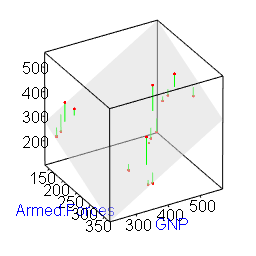

[](http://quantlet.de/)

## [](http://quantlet.de/) **BCS_BivariateRegression** [](http://quantlet.de/)

```yaml


Name of Quantlet:     'BCS_BivariateRegression'

Published in:         'Basic Elements of Computational Statistics'

Description:          'Three dimensional interactive scatterplot for unemployment
                       regressed on the number of armed forces and the GNP.
                       The data belongs to the longley dataset. A hyperplane for the
                       regression results shows a negative realtionship between
                       umemployment and the number of armed forces. The increase in
                       GNP is associated wih higher unemployment this is odd.'

Keywords:             'rgl,regression,bivariate regression,plot,multivariate,continuous,
                       time series, 3D plot, plot, scatterplot, hyperplane'

Author:                Polina Marchenko

Submitted:            '2016-01-28, Christoph Schult'

Output:               'An interactive time series plot for the longley dataset.'

```



### R Code
```r

# install.packages('rpanel')
require(rpanel)  # load required package rpanel
data(longley)  # load dataset longley
attach(longley)  # attach dataset longley
rp.regression(cbind(GNP, Armed.Forces), Unemployed, panel.plot = F)  # regression 3D plot
```

automatically created on 2023-03-27