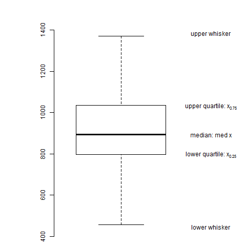

[](http://quantlet.de/)

## [](http://quantlet.de/) **BCS_Boxplot2** [](http://quantlet.de/)

```yaml


Name of Quantlet:    'BCS_Boxplot2'

Published in:        'Basic Elements of Computational Statistics'

Description:         'Boxplot of R example dataset Nile and manual calculation and
                      notation of important values. The notation on the axes is
                      calculated manually, giving a nice example of the calcuation of a five
                      number summary, on which the box-plot is based. Note that R by default
                      draws the whiskers to the highest/lowest value in the sample which is
                      still in the upper-/lower fence.'

Keywords:            'boxplot, Nile, data visualization, outlier detection, histogram'

Author[New]:          Gunawan

Submitted:           '2016-01-28, Christoph Schult'

Output:              'Boxplot of Nile in .pdf format'

```



### R Code
```r

# margins (bottom, left, top, right)
par(mai = c(b = 0.01, l = 1e-04, t = 0.01, r = 0.1))
# Box-plot located at x=0.8 without frame, with default 1.5 range and outliers
boxplot(Nile, at = 0.8, frame = F, range = 1.5, outline = T, yaxt = "n", ylim = c(400, 1500))

# Add a y axis
axis(2, pos = 0.5, col.axis = "black", las = 0)

# compute the quartiles and lower&upper fence
lowq = quantile(Nile, probs = 0.25)
median = quantile(Nile, probs = 0.5)
uppq = quantile(Nile, probs = 0.75)
lowerfence = lowq - 1.5 * (diff(quantile(Nile, probs = c(0.25, 0.75))))
upperfence = uppq + 1.5 * (diff(quantile(Nile, probs = c(0.25, 0.75))))
# Compute the endpoint of each whisker, e.g. the max/min value still within the upper/lower-fence
lowerwhisker = min(Nile[Nile > lowerfence])
upperwhisker = max(Nile[Nile < upperfence])

# write description in the Box-Plot
text(1.2, lowq, expression("lower quartile: x"[0.25]), font = 2)
text(1.2, median, expression("median: med x"), font = 2)
text(1.2, uppq, expression("upper quartile: x"[0.75]), font = 2)
text(1.2, upperfence, "upper whisker", font = 1)
text(1.2, lowerfence, "lower whisker", font = 1)
```

automatically created on 2023-03-28