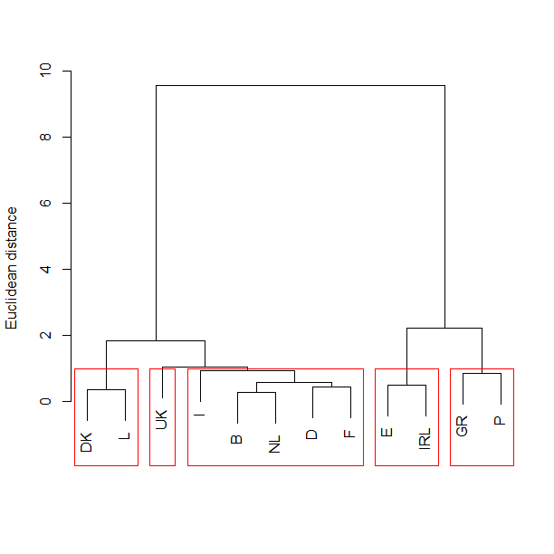

[](http://quantlet.de/)

## [](http://quantlet.de/) **BCS_CAComplete** [](http://quantlet.de/)

```yaml


Name of Quantlet:    'BCS_CAComplete'

Published in:        'Basic Elements of Computational Statistics'

Description:         'Performs a cluster anlalysis on the data "agriculture" from
                      package "cluster" using the Ward algorithm. The result is depicted in a
                      dendrogram with the optimal clusters highlighted by red boxes.'

Keywords:            'cluster, analysis, agriculture, dendogram, cluster anylsis, plot'

Author[New]:          Anastasija Tetereva

Submitted:           '2016-01-28, Christoph Schult'

Output:              'Plot of a dendrogram'

```



### R Code
```r


library("cluster")  # load package for cluster analysis
data("agriculture", package = "cluster")  # load the data
mydata = scale(agriculture)  # normalize the data
d = dist(mydata, method = "euclidean")  # calculate distance matrix
print(d, digits = 2)  # show distance matrix
fit = hclust(d, method = "ward")  # fit the model

dev.new()
plot(fit, main = "", , sub = "", xlab = "", ylab = "Euclidean distance")  # plot the solution
groups = cutree(fit, k = 5)  # define clusters
rect.hclust(fit, k = 5, border = "red")  # draw boxes
```

automatically created on 2023-03-28