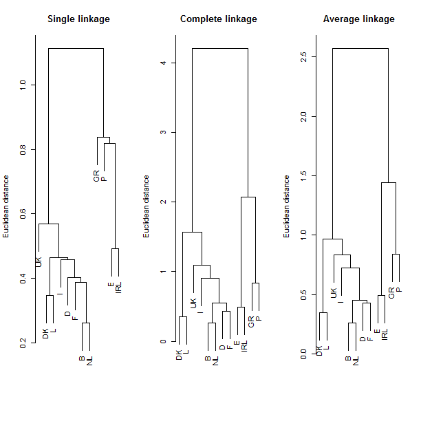

[](http://quantlet.de/)

## [](http://quantlet.de/) **BCS_CAmethods** [](http://quantlet.de/)

```yaml


Name of Quantlet:   'BCS_CAmethods'

Published in:       'Basic Elements of Computational Statistics'

Description:        'Perform a cluster analysis using single, complete and average linkage
                     algorithms on the data set "agriculture" from the package "cluster". 
                     The three resulting dendrograms are plotted to show the divergence in the results.'

Keywords:           'plot, cluster, analysis, average linkage, dendrograms'

Author[New]:         Anastasija Tetereva
 
Submitted:          '2016-01-28, Christoph Schult'


Output:             'Combined plot of three dendrograms of different clustering methods'

```



### R Code
```r


library("cluster")  # install package for cluster analysis
data("agriculture", package = "cluster")  # load the data
mydata = scale(agriculture)  # normalize the data
d = dist(mydata, method = "euclidean")  # calculate distance matrix
print(d, digits = 2)  # show distance matrix

dev.new()
par(mfrow = c(1, 3))  # draw 3 differents methods in one plot
plot(hclust(d, method = "single"), main = "Single linkage", sub = "", xlab = "", ylab = "Euclidean distance")
plot(hclust(d, method = "complete"), main = "Complete linkage", sub = "", xlab = "", ylab = "Euclidean distance")
plot(hclust(d, method = "average"), main = "Average linkage", sub = "", xlab = "", ylab = "Euclidean distance")
```

automatically created on 2023-03-27