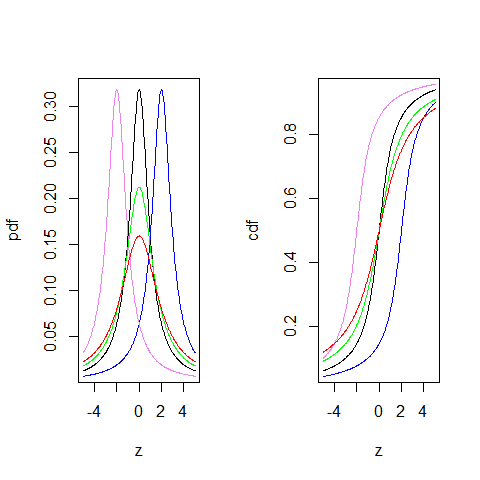

[](http://quantlet.de/)

## [](http://quantlet.de/) **BCS_CauchyPdfCdf** [](http://quantlet.de/)

```yaml


Name of Quantlet:       'BCS_CauchyPdfCdf'

Published in:           'Basic Elements of Computational Statistics'

Description:            'The Cauchy distribution has no mean and no variance. 
                         Its location and form are defined by the parameters 
                         mu and sigma. Mu defines the position of the peak 
                         (mode) and the median.'

Keywords:               'cauchy,poisson,kernel,univariate,continuous,distribution,
                         lorenz, pdf, cdf,standard, student, t-distribution, stable'

See also:               'BCS_StablePdfCdf, BCS_ExpPdfCdf,
                         BCS_StablePdfCdfSpecial, BCS_ChiPdfCdf,
                         BCS_FPdfCdf, BCS_NormPdfCdf, BCS_tPdfCdf'

Author:                  Ivan Vasylchenko, Benjamin Samulowski, Noa Tamir

Submitted:              '2016-01-28, Christoph Schult'


Output:                 'Plots pdfs and cdfs for cauchy distribution with different
                         moments'

```



### R Code
```r

graphics.off()  # close all windows
par(mfrow = c(1, 2))

# rv chauchy distributed
z = seq(-5, 5, length = 300)

# pdf for the chauchy
plot(z, dcauchy(z, 0, 1), xlab = "z", ylab = "pdf", type = "l", lwd = 1)  # mu = 0 & sd = 1
lines(z, dcauchy(z, 2, 1), col = "blue")  # mu = 2 & sd = 1
lines(z, dcauchy(z, -2, 1), col = "violet")  # mu = -2 & sd = 1
lines(z, dcauchy(z, 0, 1.5), col = "green")  # mu = 0 & sd = 1.5
lines(z, dcauchy(z, 0, 2), col = "red")  # mu = 0 & sd = 2

# cdf for the chauchy mu = 0 & sd = 1 same order as above
plot(z, pcauchy(z, 0, 1), xlab = "z", ylab = "cdf", type = "l", lwd = 1)
lines(z, pcauchy(z, 2, 1), col = "blue")
lines(z, pcauchy(z, -2, 1), col = "violet")
lines(z, pcauchy(z, 0, 1.5), col = "green")
lines(z, pcauchy(z, 0, 2), col = "red")
```

automatically created on 2023-03-28