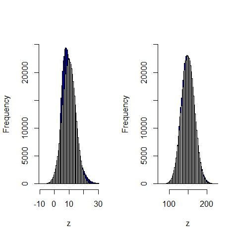

[](http://quantlet.de/)

## [](http://quantlet.de/) **BCS_ChiNormApprox** [](http://quantlet.de/)

```yaml


Name of Quantlet:      'BCS_ChiNormApprox'

Published in:          'Basic Elements of Computational Statistics'

Description:           'A chi-squared distributed random variable is the sum of
                        independent standard normally distributed rv. Histograms for
                        continuous variables just estimate the pdf of the rv.
                        As the degrees of freedom increase the empirical density (histogram)
                        converges to the normal distribution.'

Keywords:              'distribution,chisquare,pdf,approximation,univariate,normal,
                        asymptotic,standard,continuous,histogram'

See also:              'BCS_tQQplots, 
                        BCS_ChiPdfCdf, 
                        BCS_tPdfCdf'

Author:                 Ivan Vasylchenko, Benjamin Samulowski, Noa Tamir

Submitted:             '2016-01-28, Christoph Schult'


Output:                'Plots histogramms for a chi-squared and normal distributed rv
                        for different sample sizes.'

```



### R Code
```r

graphics.off()  # close all windows
par(mfrow = c(1, 2))

# number of observations stays the same 10 degrees of freedom for the chi-squared distribution
df = 10
x = rchisq(5e+05, df)
norm = rnorm(5e+05, df, sqrt(2 * df))


hist(x, breaks = 70, col = "blue", angle = 45, main = "", xlab = "z", xlim = c(df - 6 * sqrt(df), df + 6 * sqrt(df)), 
    ylim = c(0, 25000))  # highest frequency for the normal distribution
hist(norm, breaks = 70, col = "white", add = TRUE)


# 150 degrees of freedom for the chi-squared distribution
df = 150
x = rchisq(5e+05, df)
norm = rnorm(5e+05, df, sqrt(2 * df))

hist(x, breaks = 70, col = "blue", angle = 45, main = "", xlab = "z", xlim = c(df - 6 * sqrt(df), df + 6 * sqrt(df)), 
    ylim = c(0, 25000))
hist(norm, breaks = 70, col = "white", add = TRUE)
```

automatically created on 2023-03-27