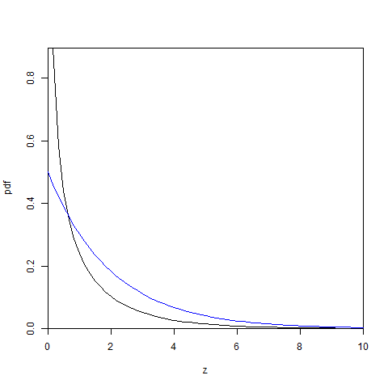

[](http://quantlet.de/index.php?p=info)

## [](http://quantlet.de/) **BCS_ChiPdf** [](http://quantlet.de/d3/ia)

```yaml

Name of Quantlet : BCS_ChiPdf

Published in : Basic Computational Statistics

Description : 'The Chi-squared distribution has two special pdfs. If the degrees of freedom are
equal to one, the mean is undefined and the vertical axis is an asymptote. If the degrees of
freedom are equal to two the pdf steadily decreases from 0.5.'

Keywords : distribution,chisquare,pdf,continuous,univariate,cauchy

See also : BCS_ChiPdfCdf, BCS_FPdfCdf, BCS_NormPdfCdf, BCS_tPdfCdf

Author : Ivan Vasylchenko, Benjamin Samulowski, Noa Tamir

Submitted : 2016-01-28, Christoph Schult

Output : Plots pdf for two special cases of the chisquare distribution.

```




```r

par(mfrow = c(1, 1))

# random variable
z = seq(0, 50, length = 300)

# degrees of freedom
m = c(1, 2)

# chi-squared distribution with first moment
plot(z, dchisq(z, m[1]), type = "l", xlab = "z", ylab = "pdf", xlim = c(0, 10), xaxs = "i", yaxs = "i")
# chi-squared distribution with first and second moment
lines(z, dchisq(z, m[2]), col = "blue")
```
