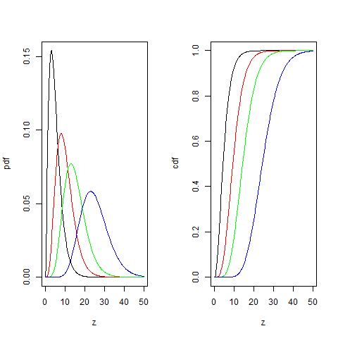

[](http://quantlet.de/)

## [](http://quantlet.de/) **BCS_ChiPdfCdf** [](http://quantlet.de/)

```yaml


Name of Quantlet:        'BCS_ChiPdfCdf'

Published in:            'Basic Elements of Computational Statistics'

Description:             'The chi-square distribution describes the sum of independent
                          squared standard normal random variables. Most commonly used
                          in tests regarding the sample variance. The pdf is bell shaped,
                          moves to the right and becomes symmetric for higher degrees of
                          freedom.'

Keywords:                'continuous,normal,squared,univariate,distribution,variance,
                          standard,error,chisquare,estimation'

See also:                'BCS_ExpPdfCdf, BCS_StablePdfCdf, BCS_StablePdfCdfSpecial,
                          BCS_CauchyPdfCdf, BCS_FPdfCdf, BCS_NormPdfCdf, BCS_tPdfCdf,
                          BCS_ChiPdf'

Author:                   Ivan Vasylchenko, Benjamin Samulowski, Noa Tamir

Submitted:               '2016-01-28, Christoph Schult'


Output:                  'Plots pdfs and cdfs for chi-squared distribution with different
                          degrees of freedom.'

```



### R Code
```r

par(mfrow = c(1, 2))

# rv for the chi-squared distribution
z = seq(0, 50, length = 300)

# degrees of freedom
df = c(5, 10, 15, 25)

# pdf of chi-squared
plot(z, dchisq(z, df[1]), type = "l", xlab = "z", ylab = "pdf")
# pdf for df=10
lines(z, dchisq(z, df[2]), col = "red")
# pdf for df=15
lines(z, dchisq(z, df[3]), col = "green")
# pdf for df=25
lines(z, dchisq(z, df[4]), col = "blue")

# order of df as above cdf of chi-squared
plot(z, pchisq(z, df[1]), type = "l", xlab = "z", ylab = "cdf")
lines(z, pchisq(z, df[2]), col = "red")
lines(z, pchisq(z, df[3]), col = "green")
lines(z, pchisq(z, df[4]), col = "blue")
```

automatically created on 2023-03-27