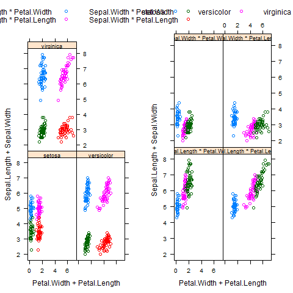

[](http://quantlet.de/index.php?p=info)

## [](http://quantlet.de/) **BCS_ConditionalGrouped** [](http://quantlet.de/d3/ia)

```yaml

Name of Quantlet : BCS_ConditionalGrouped

Published in : Basic Elements of Computational Statistics

Description : 'The plots for a conditional or grouped variable differ, even if you use the same
variable. The left plot has three panels for the types of Species and contains four different
combinations of iris characteristics. This plot corresponds to Species as a conditioning variable.
Species as a grouping variable produces the right plot. Here four panels are created, which differ
by combinations of variables and types of species.'

Keywords : trellis,grouped,conditional,panel,plot,variable,multivariate, data,panels,lattice

See also :

Author : Polina Marchenko

Submitted : 2016-01-28, Christoph Schult

Output : 'Two plots for the dataset iris with Species as conditioning (left) and grouping (right)
variable.'

```




```r
# make sure the package is installed install.packages('lattice')
require(lattice)
graphics.off()

# Plots sepal appears on the y-axis and petal on the x-axis for each flower the sum of width and height are plotted

# Conditional Plots
plot1 = xyplot(Sepal.Length + Sepal.Width ~ Petal.Width + Petal.Length | Species, data = iris, auto.key = list(columns = 2, 
    lines = F, points = T), par.strip.text = list(cex = 0.75))  # size of the text in the plot

# Grouped Plots
plot2 = xyplot(Sepal.Length + Sepal.Width ~ Petal.Width + Petal.Length, groups = Species, data = iris, auto.key = list(columns = 3, 
    lines = F, points = T), par.strip.text = list(cex = 0.75))

# it is not possible to use layout or par to get multiple plots
print(plot1, position = c(0, 0, 1, 1), split = c(1, 1, 2, 1), more = TRUE)
print(plot2, position = c(0, 0, 1, 1), split = c(2, 1, 2, 1), more = TRUE) 
```
