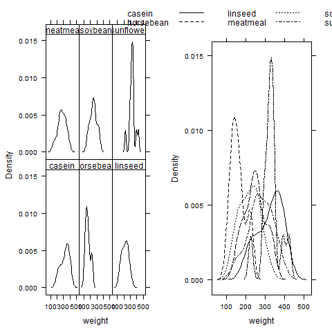

[](http://quantlet.de/index.php?p=info)

## [](http://quantlet.de/) **BCS_ConditionalGroupedDensity** [](http://quantlet.de/d3/ia)

```yaml

Name of Quantlet : BCS_ConditionalGroupedDensity

Published in : Basic Elements of Computational Statistics

Description : 'The plots for the density of a conditional or grouped variable are for the used data
the same. In this case it is preferable to use the same variable as a group variable. R produces
one panel with the densities for the different groups, which are drawn with different lines.
Therefore a direct comparison of the different groups is possible. In this example the dependency
of weight and the food of chickens is illustrated.'

Keywords : lattice,grouped,conditional,panel,plot,variable,multivariate, data,plot,density

Author : Polina Marchenko

Submitted : 2016-01-28, Christoph Schult

Output : 'Two plots for the densities of the weight of chickens with Feed as conditioning (left)
and grouping (right) variable.'

```




```r
# make sure the package is installed install.packages('lattice')
require(lattice)

# Conditional density plots for chickwts dataset Chicken weights are plotted conditioned on their food.
denweight = densityplot(~weight | feed, data = chickwts, plot.points = F, scales = list(alternating = 1), ylab = "Density")

# Grouped superposed density plots(chickwts)
denweight2 = densityplot(~weight, data = chickwts, groups = feed, plot.points = F, auto.key = list(columns = 3), ylab = "Density")
graphics.off()
# Black and white settings

lattice.options(default.theme = modifyList(standard.theme(color = FALSE), list(strip.background = list(col = "transparent"))))

# displaying more than one graph at once
print(denweight, position = c(0, 0, 1, 1), split = c(1, 1, 2, 1), more = TRUE)  # Feed as conditional variable
print(denweight2, position = c(0, 0, 1, 1), split = c(2, 1, 2, 1), more = TRUE)  # Feed as grouped variable

# to set the color scheme to default
detach("package:lattice", unload = TRUE)
require(lattice)
```
