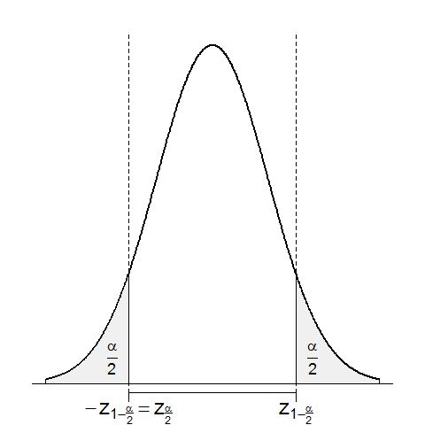

[](http://quantlet.de/)

## [](http://quantlet.de/) **BCS_Conf2sided** [](http://quantlet.de/)

```yaml

Name of Quantlet : BCS_Conf2sided

Published in : Basic Elements of Computational Statistics

Description : 'Graphic of a normal distribution N(0,1), also called standard normal distribution,
with a two-tailed (1-alpha)-confidence interval. It is sometimes called Gauss, after the
mathematician, or Bell curve, after its shape.'

Keywords : normal distribution, visualization, testing, confidence interval, plot

See also : BCS_ecdf

Author[New] : Gunawan

Submitted : 2016-01-28, Christoph Schult

Output : Plot of a normal distribution function in .pdf format.

```




### R Code:
```r
# creating values a as a sequence from -3 to 3
a = seq(from = -3, to = 3, by = 0.01)
# calculating the densities of these values given the default mean=0 sd=1 normal distribution
b = dnorm(a)

# margins (bottom,left,top,right) , font style, axis label size
par(mai = c(b = 0.5, l = 0.5, t = 0.5, r = 0.5), font = 4, cex.axis = 1.5)
# axis switched off, line width=2
plot(x = a, y = b, type = "l", ylab = "", xlab = "", axes = F, lwd = "2")
# 3 vertical lines
abline(h = 0)
abline(v = -1.5, lty = 2)
abline(v = 1.5, lty = 2)
# Create and the x-axis, cex for text size
axis(1, at = c(-1.5, 1.5), labels = expression(-z[1 - frac(alpha, 2)] == z[frac(alpha, 2)], z[1 - frac(alpha, 2)]), font = 2, 
    cex = 2)
# Filling LEFT
polygon(x = c(-1.5, a[1:151]), y = c(0, 0, b[2:151]), col = "gray94")
# Filling RIGHT
polygon(x = c(1.5, rev(a[451:601])), y = c(0, 0, rev(b[452:601])), col = "gray94")
# Write alphas in the area of interest
text(-1.8, 0.03, expression(frac(alpha, 2)), cex = 1.1)
text(1.8, 0.03, expression(frac(alpha, 2)), cex = 1.1)
```
