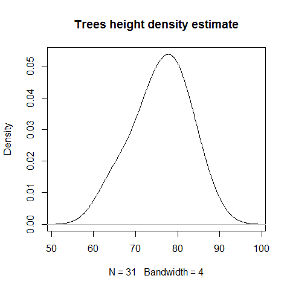

[](http://quantlet.de/index.php?p=info)

## [](http://quantlet.de/) **BCS_ControlDensityEstimate** [](http://quantlet.de/d3/ia)

```yaml

Name of Quantlet : BCS_ControlDensityEstimate

Published in : Basic Elements of Computational Statistics

Description : 'The rpanel package employs different graphical user interface (GUI) controls to
enable the immediate communication with the graphical output and provides dynamic graphics. In this
example a control panel with a slider and a double button is created to control the bandwidth of a
density plot.'

Keywords : rpanel,tcltk,slider,double,button,plot,density,bandwidth,three dimensional plot

See also : 'BCS_HistogramBoxplotOption BCS_rp.tkrplot BCS_UnivariateRegression
BCS_BivariateRegression BCS_NormalDensityFit'

Author : Polina Marchenko

Submitted : 2016-01-28, Christoph Schult

Input : None

Output : Density plot and control panel for altering the bandwidth

```




```r
# Load tcltk and rpanel packages (have to be installed)
require(tcltk)
require(rpanel)

# Load trees data included in R
attach(trees)

# Define the range of the variable Height
r = diff(range(Height))

# Define function for producing a density plot function takes 'panel' as argument
density.draw = function(panel) {
    plot(density(panel$y, panel$sp), main = "Trees height density estimate")  # define title of the plot
    panel
}

# Create the control panel
density.panel = rp.control("density estimation", y = Height, sp = r/8)  # define variables that shall be used by the panel object (= the density plot)

# Add a slider to the panel window
rp.slider(density.panel, sp, from = r/40, to = r/2, action = density.draw, title = "Bandwidth")  # add a title to the slider

# Add a widget with '+' and '-' buttons
rp.doublebutton(density.panel, sp, step = 1.03, log = T, range = c(r/50, NA), title = "Bandwidth", action = density.draw)  # call the function density.draw
```
