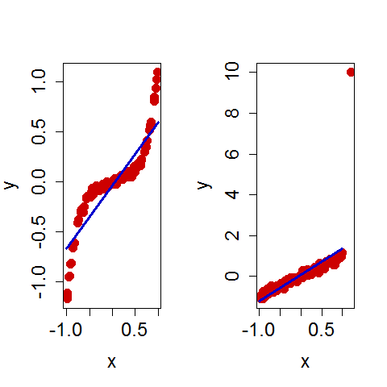

[](http://quantlet.de/)

## [](http://quantlet.de/) **BCS_CopulaInvarOutlier** [](http://quantlet.de/)

```yaml


Name of Quantlet:          'BCS_CopulaInvarOutlier'

Published in:              'Basic Elements of Computational Statistics'

Description:               'Two random variables are created. One is normally distributed
                            and one is uniformly distributed. Their correlations are
                            calculated with different methods. Kendall and Spearman''s
                            methods are superior to Pearson''s correlation measure. Both
                            are less variant due to monotone increasing transformations
                            and outliers.'

Keywords:                  'distribution, correlation, extreme, value, multivariate, linear, 
                            approximation, uniform, transformation, normal, polynomial'

Author:                     Ostap Okhrin

Submitted:                 '2016-01-28, Christoph Schult'


Output:                    'Two plots for the approximation of a uniformly distributed  rv by
                            a normally distributed rv. One with no outlier and one with outlier.'

```



### R Code
```r

graphics.off()
par(mfrow = c(1, 2))
# sample size
n = 100
# uniformly distributed rv
x = runif(min = -1, max = 1, n)
# the sum of a normal distrbuted rv and the ploynomial of the uniform distributed rv
y = rnorm(n, mean = 0, sd = 0.02) + x^5 + x * 0.2

# covariance of x and y relative to variance of x
b1 = var(x, y)/var(x)
# intercept of the line through the ordinate
b0 = mean(y) - b1 * mean(x)

# scatterplot of x and y without outlier
plot(x, y, type = "p", pch = 19, col = "red3", cex = 1.5, cex.axis = 1.5, cex.lab = 1.5)
# fitted linear line of x and y
lines(x = c(-1, 1), y = c(b0 - b1, b0 + b1), lwd = 3, col = "blue3")
# abline(a=0,b=0,h = seq(-1,1,by=0.25), seq(-1,1,by=0.25), col = 'gray', lty=3)

print(cor(x, y))
print(cor(x, y, method = "kendall"))
print(cor(x, y, method = "spearman"))

# the same uniformly distributed random variable
x = runif(min = -1, max = 1, n)
# just a linear relationship with x of the normal distributed rv
y = rnorm(n, mean = 0, sd = 0.1) + x
# outlier value x = 1.2 and y = 10
x = c(x, 1.2)
y = c(y, 10)

# slope for the line which represents y as a function of x
b1 = var(x, y)/var(x)
# intercept of the line through the ordinate
b0 = mean(y) - b1 * mean(x)

# scatterplot of x and y with outlier
plot(x, y, type = "p", pch = 19, col = "red3", cex = 1.5, cex.axis = 1.5, cex.lab = 1.5)
# fitted linear line
lines(x = c(-1, 1), y = c(b0 - b1, b0 + b1), lwd = 3, col = "blue3")

print(cor(x, y))
print(cor(x, y, method = "kendall"))
print(cor(x, y, method = "spearman"))
```

automatically created on 2023-03-28