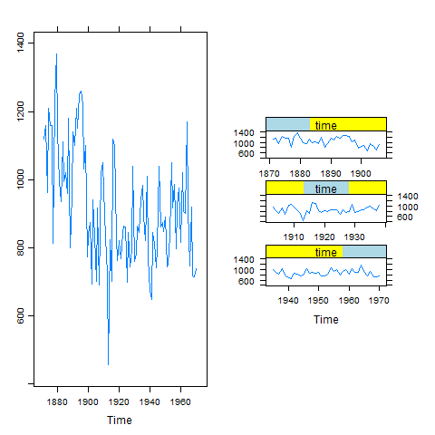

[](http://quantlet.de/)

## [](http://quantlet.de/) **BCS_DefaultStackTimeSeries** [](http://quantlet.de/)

```yaml

Name of Quantlet : BCS_DefaultStackTimeSeries

Published in : Basic Elements of Computational Statistics

Description : 'Time series datasets are easily plotted with lattice. Here the dataset Nile is used
to illustrate the usage of the package for time series data. The plots show the annual flow of the
river Nile from 1871 to 1970. The first plot depicts the whole series and the second plot splits
the series into three intervals, where each interval is one panel.'

Keywords : 'trellis, lattice, time, time series, plot, multivariate, continuous, default,
Cut-and-stack time series plot, Default time series plot'

Author : Polina Marchenko

Submitted : 2016-01-28, Christoph Schult

Output : Two time series plots for the dataset Nile.

```




### R Code:
```r
# make sure the package is installed install.packages('lattice')
library("lattice")
graphics.off()

# Time series plot
plot1 = xyplot(Nile)

# Time series cut-and-stack plots for further documentation see ?xyplot()
plot2 = xyplot(Nile, aspect = "xy", cut = list(number = 3, overlap = 0.1), strip = strip.custom(bg = "yellow", fg = "lightblue"))

# plots both graphs
print(plot1, position = c(0, 0, 1, 1), split = c(1, 1, 2, 1), more = TRUE)
print(plot2, position = c(0, 0, 1, 1), split = c(2, 1, 2, 1), more = TRUE)
```
