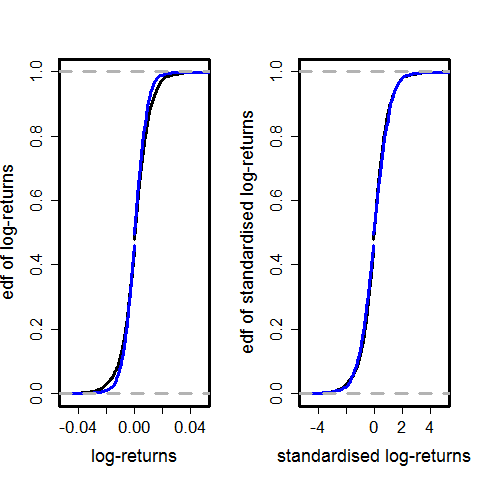

[](http://quantlet.de/index.php?p=info)

## [](http://quantlet.de/) **BCS_EdfsDAXFTSE** [](http://quantlet.de/d3/ia)

```yaml

Name of Quantlet : BCS_EdfsDAXFTSE

Published in : Basic Elements of Computational Statistics

Description : 'Two plots for the empirical cumulative distribution function standardised and not
standardised log-returns for the DAX and FTSE indeces. The edf for both is close enough for the
Kolmogorov-Smirnov test to not reject the null hypothesis of different distributions. This is not
true for non standardised log-returns.'

Keywords : 'edf,empirical cumulative distribution function,DAX,FTSE,
returns,standardisation,scatterplot,density estimation,plot, nonparametric'

Author[New] : Christoph Schult

Submitted : 2016-01-28, Christoph Schult

Output : 'Two scatter plots for the edfs of standardised and non standardised log-retunrs of the
DAX and FTSE indeces. Log-retuns for the DAX index are depicted in black and the FTSE index
log-retunrs in blue.'

```




```r
require(datasets)  # load necessary package for DAX index data

dax = EuStockMarkets[, 1]  # DAX index
r.dax = diff(log(dax))  # DAX log-returns
r.dax_m = mean(r.dax)
r.dax_sd = sd(r.dax)  # mean and standard deviation
r.dax_st = (r.dax - r.dax_m)/r.dax_sd  # standardised log-returns
ftse = EuStockMarkets[, 4]  # FTSE index
r.ftse = diff(log(ftse))  # FTSE log-returns
r.ftse_m = mean(r.ftse)
r.ftse_sd = sd(r.ftse)  # mean and standard deviation
r.ftse_st = (r.ftse - r.ftse_m)/r.ftse_sd  # standardised log-returns

# graphical parameters
par(lwd = 3, cex = 1, cex.axis = 1.4, cex.lab = 1.5, mfrow = c(1, 2))

# plot for the edfs of DAX and FTSE log-returns
plot(ecdf(r.dax), xlim = c(-0.05, 0.05), main = "", xlab = "log-returns", ylab = "edf of log-returns")
lines(ecdf(r.ftse), col = "blue")  # add edf of FTSE log-returns to plot

# plot for the edfs of DAX and FTSE standardised log-returns
plot(ecdf(r.dax_st), xlim = c(-5, 5), main = "", xlab = "standardised log-returns", ylab = "edf of standardised log-returns")
lines(ecdf(r.ftse_st), col = "blue")  # add edf of FTSE standardised log-returns to plot
```
