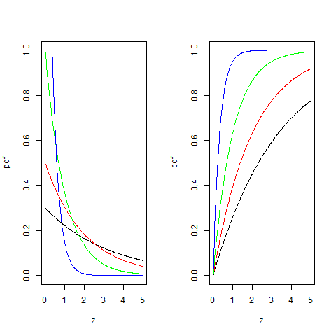

[](http://quantlet.de/index.php?p=info)

## [](http://quantlet.de/) **BCS_ExpPdfCdf** [](http://quantlet.de/d3/ia)

```yaml

Name of Quantlet : BCS_ExpPdfCdf

Published in : Basic Elements of Computational Statistics

Description : 'The exponential distribution only works for positive random variables. The normal
and logisitc distribution are special cases of the exponential distribution. Lambda defines the
steepness of the pdfs.'

Keywords : continuous,logit,univariate,distribution,exponential,pdf, cdf,normal,poisson

See also : 'BCS_StablePdfCdf, BCS_ChiPdfCdf, BCS_StablePdfCdfSpecial, BCS_CauchyPdfCdf,
BCS_FPdfCdf, BCS_NormPdfCdf, BCS_tPdfCdf'

Author : Ivan Vasylchenko, Benjamin Samulowski, Noa Tamir

Submitted : 2016-01-28, Christoph Schult

Output : Plots pdfs and cdfs for the exponential distribution with different lambdas.

```




```r
par(mfrow = c(1, 2))
z = seq(0, 5, length = 300)

# different parameter values
lambda = c(0.3, 0.5, 1, 3)

# exponential pdf for lambda = 0.3
plot(z, dexp(z, lambda[1]), type = "l", xlab = "z", ylab = "pdf", ylim = c(0, 1))
# lambda = 0.5
lines(z, dexp(z, lambda[2]), col = "red")
# lambda = 1
lines(z, dexp(z, lambda[3]), col = "green")
# lambda = 3
lines(z, dexp(z, lambda[4]), col = "blue")

# exponential cdf same order for lambdas as above
plot(z, pexp(z, lambda[1]), type = "l", xlab = "z", ylab = "cdf", ylim = c(0, 1))
lines(z, pexp(z, lambda[2]), col = "red")
lines(z, pexp(z, lambda[3]), col = "green")
lines(z, pexp(z, lambda[4]), col = "blue")
```
