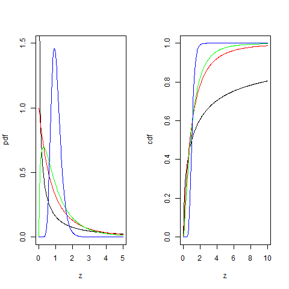

[](http://quantlet.de/index.php?p=info)

## [](http://quantlet.de/) **BCS_FPdfCdf** [](http://quantlet.de/d3/ia)

```yaml

Name of Quantlet : BCS_FPdfCdf

Published in : Basic Computational Statistics

Description : 'The F-distribution, also called the Fisher-Snedecor distribution, is the ratio of
two independent chisquared distributed random variables. The degrees of freedom of the numerator
and denominatoer determine how the pdf and cdf behave. If n=1 the pdf is monotonically decreasing
and the ordinate is the asymptote. For n=2 the pdf intersects the ordinate at 1 and monotically
decreases. Only if n>=3 the pdf is assymetrically bell shaped.'

Keywords :
'univariate,distribution,f,pdf,cdf,continuous,analysis,variance,scale,chisquare,regression'

See also : 'BCS_StablePdfCdf, BCS_ChiPdfCdf, BCS_StablePdfCdfSpecial, BCS_CauchyPdfCdf,
BCS_ExpPdfCdf, BCS_Norm_PdfCdf, BCS_tPdfCdf'

Author : Ivan Vasylchenko, Benjamin Samulowski, Noa Tamir

Submitted : 2016-01-28, Christoph Schult

Output : Plots pdfs and cdfs for F-distribution with different degrees of freedom.

```




```r
par(mfrow = c(1, 2))

# F-distributed variable
z = seq(0, 5, length = 300)
# df for the nominator
n = c(1, 2, 3, 50)
# df for the denominator
m = c(1, 6, 10, 50)

# pdf of z for n=1 & m=1
plot(z, df(z, n[1], m[1]), type = "l", xlab = "z", ylab = "pdf", ylim = c(0, 1.5))
# n=2 & m=6
lines(z, df(z, n[2], m[2]), col = "red")
# n=3 & m=10
lines(z, df(z, n[3], m[3]), col = "green")
# n=50 & m=50
lines(z, df(z, n[4], m[4]), col = "blue")

z = seq(0, 10, length = 300)
# cdf of z with respective df as above
plot(z, pf(z, n[1], m[1]), type = "l", xlab = "z", ylab = "cdf", ylim = c(0, 1))
lines(z, pf(z, n[2], m[2]), col = "red")
lines(z, pf(z, n[3], m[3]), col = "green")
lines(z, pf(z, n[4], m[4]), col = "blue")
```
