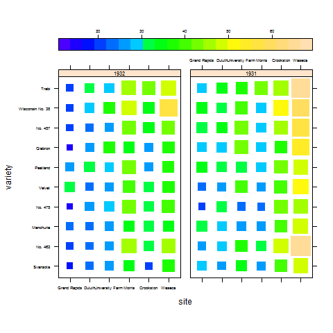

[](http://quantlet.de/)

## [](http://quantlet.de/) **BCS_FourDimensional** [](http://quantlet.de/)

```yaml


Name of Quantlet:          'BCS_FourDimensional'

Published in:              'Basic Elements of Computational Statistics'

Description:               'The datset barley contains yield data from Minnesota. Average
                            yield is plotted depnding on where it is planted (site) and
                            which variety is used. The third conditioning variable is time
                            creating two panels. Higher average yield is associated with
                            greater and lighter rectangles. Therefore four variables are
                            illustrated in one graph (yield, time, variety, site).'

Keywords:                  'trellis, lattice, rgl, four dimensional, plot, conditional, variable, 
                            conditional variable, 4D plot, factor, variable'

Author:                     Polina Marchenko

Submitted:                 '2016-01-28, Christoph Schult'


Output:                    'One plot for the dataset barley with time, variety and site as
                            conditioning variables.'

```



### R Code
```r

# make sure the package is installed install.packages('lattice') install.packages('rgl')
library(lattice)
library(rgl)
graphics.off()

# Four-dimensional plot levelplot

levelplot(yield ~ site * variety | year, data = barley, scales = list(alternating = T), shrink = c(0.3, 1), region = TRUE, 
    cuts = 20, col.regions = topo.colors(100), par.settings = list(axis.text = list(cex = 0.5)), par.strip.text = list(cex = 0.7), 
    between = list(x = 1), aspect = "iso", colorkey = list(space = "top"))
```

automatically created on 2023-03-27