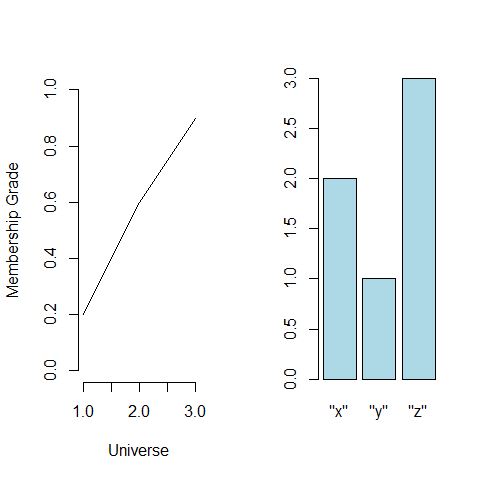

[](http://quantlet.de/)

## [](http://quantlet.de/) **BCS_FuzzyMultiSets** [](http://quantlet.de/)

```yaml


Name of Quantlet:             'BCS_FuzzyMultiSets'

Published in:                 'Basic Elements of Computational Statistics'

Description:                  'The membership grade of a fuzzy set with elements x, y, z is plotted.
                               The number of elements is plotted in a bar diagramm. '

Keywords:                     'fuzzy, multisets, membership, grade, plot, bar plot'

Author[New]:                   Christoph Schult

Submitted:                    '2016-02-06, Christoph Schult'

```



### R Code
```r

require(sets)
par(mfrow = c(1, 2))

# multiset
multi1 = gset(c("red", "blue", "blue", "blue"))  # multiset
gset_cardinality(multi)  # number of elements in the set

# fuzzy set, membership in square brackets
fuzzy1 = gset(c(1, 2, 3), membership = c(0.2, 0.6, 0.9))
plot(fuzzy1)  # output in Figure 3.1
# create multiset from R object
B = c("x", "y", "z", "z", "z", "x")
table(B)
multi2 = as.gset(B)  # converts vector to set
gset_cardinality(multi2)  # cardinality of multi2
# create multiset directly via gset
multi3 = gset(c("x", "y", "z"), membership = c(2, 1, 3))
gset_cardinality(multi3)
plot(multi3, col = "lightblue")  # right plot in Figure 3.1
```

automatically created on 2023-03-28