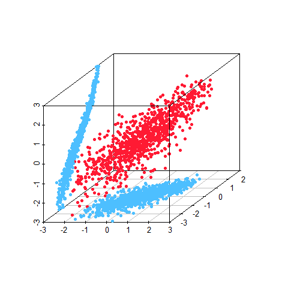

[](http://quantlet.de/)

## [](http://quantlet.de/) **BCS_HAC** [](http://quantlet.de/)

```yaml


Name of Quantlet:         'BCS_HAC'

Published in:             'Basic Elements of Computational Statistics'

Description:              'The HAC package is used to create a random sample. The
                           distribution is created iteratively. First the bivariate
                           marginal distribution is created for the variables, which have
                           a higher correlation. In the second step the bivariate marginal
                           distribution is stacked together with the remaining variable.
                           The actual observations are obtained, by using the quantile
                           function of the respective marginal distribution. The
                           trivariate distribution is plotted in a three dimensional
                           scatterplot with its bivariate marginal distributions.'

Keywords:                 'multivariate, copula, archimedean, uniform, gumbel, HAC, normal,
                           student, distribution, pdf, cdf'

Author:                    Ostap Okhrin

Submitted:                '2016-01-28, Christoph Schult'


Output:                   'A 3d scatterplot for an HAC object with normally and t distributed
                           margins.'

```



### R Code
```r

graphics.off()
library(copula)
library(HAC)
library(scatterplot3d)

# HAC for a better understanding see ?hac() or the documentation of HAC
HAC = hac(type = 1, tree = list(list("X1", "X2", 10), "X3", 2))  # defines the structure of the object
x = rHAC(1000, HAC)  # only produces random distributions in [0,1] interval
# transform estimated random probabilities to observations
Y = cbind(qnorm(x[, 1]), qt(x[, 2], 2), qnorm(x[, 3]))

# filter outliers
L = (Y >= -3) & (Y <= 3)  # logical variable (true for values in the interval)
Y = Y[L[, 1] & L[, 2] & L[, 3], ]  # remove outliers

# marginal distribution of y1 and y2
Y12 = cbind(rep(-3, length(Y)), Y[, 1], Y[, 2])
# marginal distribution of y1 and y3
Y13 = cbind(Y[, 1], rep(-3, length(Y)), Y[, 3])
# marginal distribution of y2 and y3
Y23 = cbind(Y[, 1], Y[, 3], rep(-3, length(Y)))

# plots the trivariate distribution
graph = scatterplot3d(Y, xlim = c(-3, 3), ylim = c(-3, 3), zlim = c(-3, 3), pch = 20, color = rgb(1, 0.1, 0.2), xlab = "", 
    ylab = "", zlab = "")  # no labels for the axes

# plots the bivariate distribution of y1 and y2
graph$points3d(Y12, pch = 20, col = rgb(0.3, 0.75, 1))

# plots the bivariate distribution of y2 and y3
graph$points3d(Y23, pch = 20, col = rgb(0.3, 0.75, 1))

```

automatically created on 2023-03-27