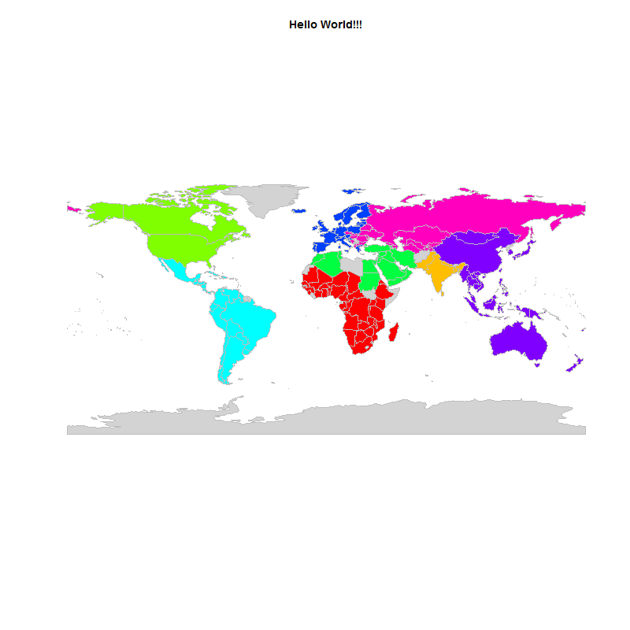

[](http://quantlet.de/index.php?p=info)

## [](http://quantlet.de/) **BCS_HelloWorld** [](http://quantlet.de/d3/ia)

```yaml

Name of Quantlet : BCS_HelloWorld

Published in : Basic Computational Statistics

Description : 'A world map as an illustrative example how powerful R is. This plot is supposed to
show new users an interesting application of R.'

Keywords : plot, worldmap, data, colorsheme, Hello World

See also :

Author : Johannes, Haupt

Submitted : 2016-01-28, Christoph Schult

Output : A world map in R.

```




```r
require(rworldmap) # load package for maps
data("countryExData", envir = environment()) # load data to plot 
# plot worldmap with different colors
mapCountryData(joinCountryData2Map(countryExData), nameColumnToPlot = "EPI_regions", catMethod = "categorical", mapTitle = "Hello World!!!", 
               colourPalette = "rainbow", missingCountryCol = "lightgrey", addLegend = FALSE)
```
