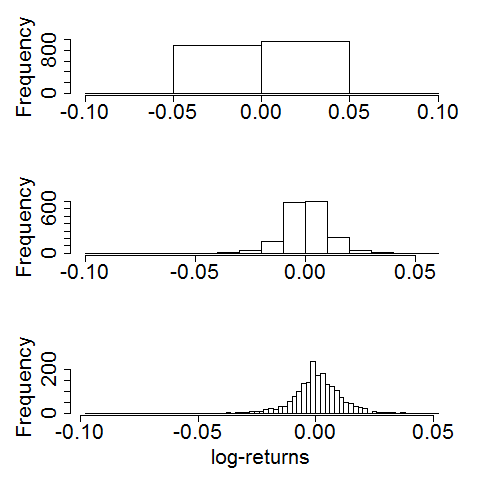

[](http://quantlet.de/)

## [](http://quantlet.de/) **BCS_HistBinSizes** [](http://quantlet.de/)

```yaml


Name of Quantlet:          'BCS_HistBinSizes'

Published in:              'Basic Elements of Computational Statistics'

Description:               'This Quantlet produces plots to show the effect of the bin
                            size on the smoothness of an histogram.'

Keywords:                  'histogram, bins, size, bin size, smoothness'

Author[New]:                Christoph Schult

Submitted:                 '2016-01-28, Christoph Schult'

Output:                    'Multiple plots with different bin sizes are produced.'

```



### R Code
```r

graphics.off()
require(datasets)

# compute log returns for DAX index
r.dax = diff(log(EuStockMarkets[, 1]))

# axes scales
xscale = c(-0.06, 0.06)
yscale = c(-0.06, 0.06)

# name of the graph and label of x
nameChart = "BCS_HistBinSizes.pdf"
xlabels = "log-returns"

# plot the histograms for different bin sizes
par(mar = par()$mar + c(0, 1.5, -1, 0.1), mfrow = c(3, 1), cex.lab = 2, cex.axis = 2, no.readonly = T)
hist(r.dax, breaks = 5, main = NULL, xlab = NULL)
hist(r.dax, breaks = 20, main = NULL, xlab = NULL)
hist(r.dax, breaks = 100, main = NULL, xlab = xlabels)
```

automatically created on 2023-03-28