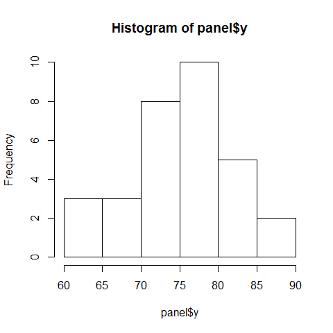

[](http://quantlet.de/)

## [](http://quantlet.de/) **BCS_HistogramBoxplotOption** [](http://quantlet.de/)

```yaml

Name of Quantlet : BCS_HistogramBoxplotOption

Published in : Basic Elements of Computational Statistics

Description : 'The rpanel package employs different graphical user interface (GUI) controls to
enable the immediate communication with the graphical output and provides dynamic graphics. In this
example the rp.listbox function is presented. The function adds a list of items to the control
panel. Selecting an item calls an action function and modifies the graphical output accordingly. In
this case rp.listbox is used to switch between a histogram and a boxplot.'

Keywords : rpanel, tcltk, listbox, boxplot, histogram

See also : 'BCS_ControlDensityEstimate, BCS_rp.tkrplot, BCS_UnivariateRegression,
BCS_BivariateRegression, BCS_NormalDensityFit'

Author : Polina Marchenko

Submitted : 2016-01-28, Christoph Schult

Output : Listbox control panel for choosing a histogram or boxplot

```





### R Code:
```r
# Load tcltk and rpanel packages (have to be installed)
library(tcltk)
library(rpanel)

# Load the trees data (included in R)
attach(trees)

# Define action function that is later called by the control panel
data.plotfn = function(panel) {
    if (panel$plot.type == "histogram") 
        hist(panel$y) else if (panel$plot.type == "boxplot") 
        boxplot(panel$y)
    panel
}

# Create the control panel
panel = rp.control(y = Height)  # define Height to be the variable used by action function

# Add a listbox to the control panel
rp.listbox(panel, plot.type, c("histogram", "boxplot"), action = data.plotfn, title = "Plot type")  # add a title to the listbox

```
