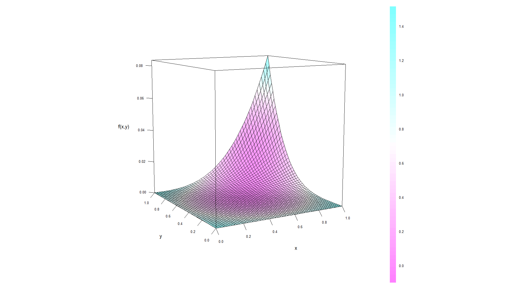

[](http://quantlet.de/index.php?p=info)

## [](http://quantlet.de/) **BCS_Integrand** [](http://quantlet.de/d3/ia)

```yaml

Name of Quantlet : BCS_Integrand

Published in : Basic Computational Statistics

Description : 'A 3d plot for the function z = (1/3) * x^3 * (1/4) * y^4, which is the integral of
its first derivative with respect to both function arguments. Both arguments are in the interval
[0, 1]. The function wireframe included in the lattice package is used.'

Keywords : Numerical integration,Integration,3D,plot,multivariate, bivariate,BCS,numerical methods

See also : 'BCS_BinormalDensity, BCS_NormalProbability, BCS_NormalCopula,
BCS_ConditionalGroupedDensity'

Author[New] : Christoph, Schult

Submitted : 2016-01-28, Christoph Schult

Output : A 3d plot of the function z = (1/3) * x^3 * (1/4) * y^4.

```




```r
x = matrix(rep(seq(0, 1, length.out = 52), 52), 52)  # function argument x in [0,1]
y = t(x)  # function argument y in [0,1]
z = (1/3) * x^3 * (1/4) * y^4  # integrated function z

par.set = list(axis.line = list(col = "transparent"), clip = list(panel = "off"))  # for the wireframe plot

names(par.set) = c("axis.line", "clip")  # assigning names to each element of the list

require("lattice")  # required lattice package
wireframe(z ~ x * y, shade = F, aspect = 1, scales = list(col = "black", arrows = FALSE), drape = T, colorkey = T, screen = list(z = 30, 
    x = -80), par.settings = par.set, xlab = list("x", cex = 1.2), ylab = list("y", cex = 1.2), zlab = list("f(x,y)", 
    cex = 1.2))
```
