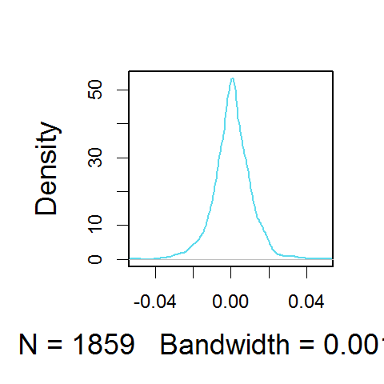

[](http://quantlet.de/)

## [](http://quantlet.de/) **BCS_KernelDAX** [](http://quantlet.de/)

```yaml


Name of Quantlet:          'BCS_KernelDAX'

Published in:              'Basic Elements of Computational Statistics'

Description:               'A simple density estimation with the epanechnikov kernel for
                            the DAX log-returns. The plot states the number of obervations
                            N = 1859 and the auto-selected bandwidth, optimally chosen by
                            the function density equal to 0.001645.'

Keywords:                  'kernel, bandwidth, weights, density estimation, plot, nonparametric, 
                            kernel density estimation, DAX, log-returns, epanechnikov'

Author[New]:                Christoph Schult

Submitted:                 '2016-01-28, Christoph Schult'


Output:                    'One plot for a kernel density estimation of the DAX log-returns by
                            the density function with the epachenikov kernel.'

```



### R Code
```r

graphics.off()  # reset previous graphical settings
require(datasets)  # load required dataset 
r.dax = diff(log(EuStockMarkets[, 1]))  # define the log retunrs for the DAX index

par(mar = par()$mar + c(0, 1.5, -1, 0.1), cex = 1.5, cex.lab = 1.5, lwd = 2)
y = density(r.dax, kernel = "epanechnikov")  # density estimation for DAX log-returns
plot(y, xlim = c(-0.05, 0.05), col = rgb(0.1, 0.8, 0.9, alpha = 0.7), main = "")
```

automatically created on 2023-03-28