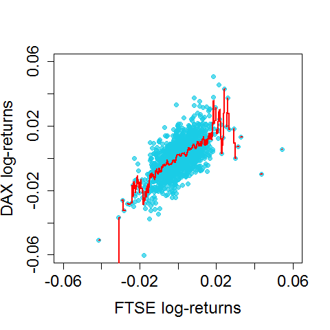

[](http://quantlet.de/)

## [](http://quantlet.de/) **BCS_KernelSmoother** [](http://quantlet.de/)

```yaml


Name of Quantlet:             'BCS_KernelSmoother'

Published in:                 'Basic Elements of Computational Statistics'

Description:                  'A unform kernel regression for DAX log-returns on FTSE
                               log-returns. Higher log-retunrs of the FTSE predict higher
                               log-returns of the DAX. This comovement seems reasonable
                               considering the close relationship between both indices.'

Keywords:                     'kernel, regression, DAX, FTSE, log-returns, estimation, plot, 
                               nonparametric, univariate nonparametric regression, uniform, 
                               bandwidth'

Author[New]:                   Christoph Schult

Submitted:                    '2016-01-28, Christoph Schult'


Output:                       'One plot for a kernel regression of the DAX log-returns on FTSE
                               log-returns.'

```



### R Code
```r

graphics.off()
require(datasets)
# define log-returns
r.dax = diff(log(EuStockMarkets[, 1]))  # daily DAX log-returns
r.ftse = diff(log(EuStockMarkets[, 4]))  # daily FTSE log-returns

# uniform kernel regression
r.dax.hat = ksmooth(x = r.ftse, y = r.dax, kernel = "box", bandwidth = 0.001)  # and bandwidth equal to 0.001

# Plot for the regression line and data points
par(cex.axis = 1.5, cex.lab = 1.5, pch = 19, cex = 1)
plot(r.ftse, r.dax, xlim = c(-0.06, 0.06), ylim = c(-0.06, 0.06), xlab = "FTSE log-returns", ylab = "DAX log-returns", 
    col = rgb(0.1, 0.8, 0.9, alpha = 0.7))
lines(r.dax.hat, col = "red", lwd = 2)
```

automatically created on 2023-03-28