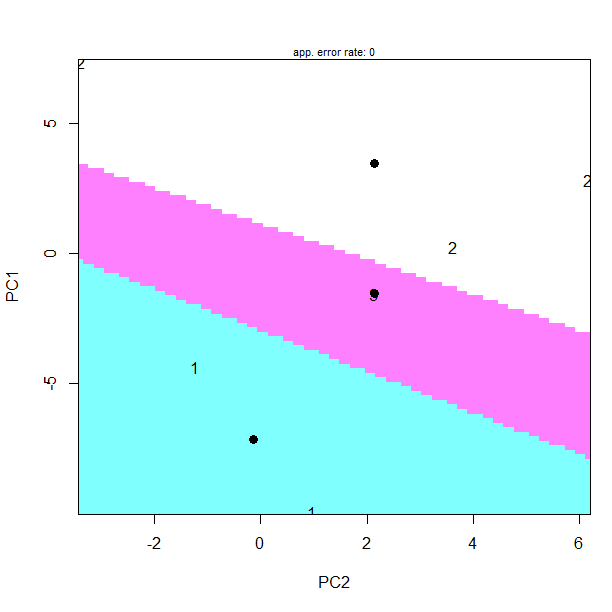

[](http://quantlet.de/index.php?p=info)

## [](http://quantlet.de/) **BCS_LDA** [](http://quantlet.de/d3/ia)

```yaml

Name of Quantlet : BCS_LDA

Published in : Basic Elements of Computational Statistics

Description : 'Example of Linear Discriminant analysis using the data "spanish" and "spanishMeta"
from package "LanguageR". The data is randomly split into a training and test set beforehand. The
observations and discrimiation borders are shown in a plot and the prediction error is calculated.'

Keywords : linear, discriminant, analysis, linear discrimination, prediction, random

Submitted : 2016-01-28, Christoph Schult

Author[New] : Johannes Haupt

Output : Plot of observations and discrimination borders.

```




```r
library("languageR")
data(spanish, package = "languageR")  # load the data

mydata = t(spanish)  # transpose the data
pca = prcomp(mydata, center = TRUE, scale = TRUE)  # fit pca model
datalda = (pca$x)  # change data format for lda
datalda = datalda[order(rownames(datalda)), ]
data(spanishMeta, package = "languageR")  # load additional data

library(MASS)  # load package for lda
mydata = cbind(datalda[, 1:2], spanishMeta$Author)
colnames(mydata) = c("PC1", "PC2", "Author")
mydata[, 3] = as.factor(mydata[, 3])

# split the dataset in a training and test set
set.seed(123)  # set seed
smp_size = floor(0.6 * nrow(mydata))  # set training set size
indeces = sample(seq_len(nrow(mydata)), size = smp_size)
mydata_train = mydata[indeces, ]  # select the training set
mydata_test = mydata[-indeces, ]  # select the test set

fit = lda(mydata_train[, 1:2], as.factor(mydata_train[, 3]))  # fit lda model

library(klaR)
dev.new()
partimat(as.factor(mydata_test[, 3]) ~ mydata_test[, 1:2], method = "lda", name = c("PC1", "PC2"), main = "")
pred.class = predict(fit, mydata_test[, 1:2])$class  # predicted class
pred.table = table(mydata_test[, 3], pred.class)  # gives table of predicted and true values
pred.correct = diag(prop.table(pred.table, 1))  # gives percentage of correct prediction in each group
1 - sum(diag(prop.table(pred.table)))  # gives prediction error for all dataset
```
