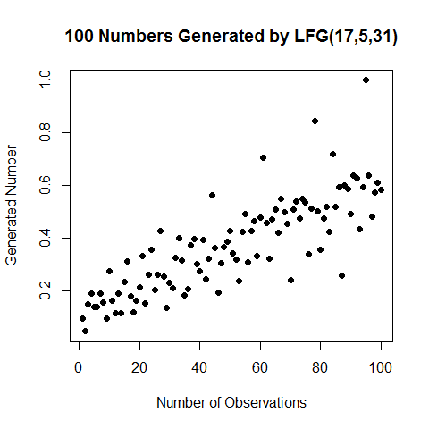

[](http://quantlet.de/)

## [](http://quantlet.de/) **BCS_LFG** [](http://quantlet.de/)

```yaml

Name of Quantlet : BCS_LFG

Published in : Basic Elements of Computational Statistics

Description : 'Implementation of the Lagged Fibonacci Generator (LFG) for random numbers. The seed
is a sequence of j integers, of which one integer should be odd. The value of the modulus is 2^l
and j and k denote the number of lags. Resulting from the use of the Fibonacci Sequence, the
generated sequences do not have satisfactory randomness properties.'

Keywords : Fibonacci, lagged, generator, random, plot

Author[New] : Martin Schelisch

Submitted : 2016-01-28, Christoph Schult

Input : 1 - value of the modulus 2^l j, k - number of lags

Output : A vector and plot of pseudorandom numbers

```




### R Code:
```r

lfg = function(j, k, l, n) {
    # generate the seed
    seed = runif(j, 0, 2^l)
    for (i in 1:n) {
        seed[j + i] = seed[i] + seed[j + i - k]%%2^l
    }
    # standardize to [0:1]
    X = seed[(j + 1):length(seed)]/max(seed)
    print(X)
}
# generate 4 new random numbers
plot(lfg(17, 5, 31, 100), main = "100 Numbers Generated by LFG(17,5,31)", xlab = "Number of Observations", ylab = "Generated Number", 
    pch = 19)
```
