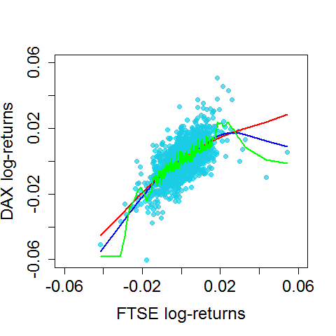

[](http://quantlet.de/index.php?p=info)

## [](http://quantlet.de/) **BCS_LOESS** [](http://quantlet.de/d3/ia)

```yaml

Name of Quantlet : BCS_LOESS

Published in : Basic Elements of Computational Statistics

Description : 'Multiple LOESS regressions for DAX log-returns on FTSE log-returns. The parameter
alpha is alternated to see the effect of this parameter for the regression results. The smootheness
of the regression line increases with a higher alpha. This causes a smaller bias but a higher
variance.'

Keywords : 'splines,regression,DAX,FTSE,log-returns,estimation,plot, nonparametric,univariate
nonparametric regression, lambda,different lambdas'

See also : BCS_Splines

Author[New] : Christoph Schult

Submitted : 2016-01-28, Christoph Schult

Output : 'One plot for multiple LOESS regressions of the DAX log-returns on FTSE log-returns.
Different regression lines correspond to different alpha.'

```




```r
graphics.off()
# load necessary packages
require(datasets)
require(class)
require(grDevices)
require(lattice)

# define log-returns for the DAX and FTSE indeces
r.dax = diff(log(EuStockMarkets[, 1]))
r.ftse = diff(log(EuStockMarkets[, 4]))

# estimated log-returns for the DAX index for different bandwidths
loess.reg.a1 = loess(r.dax ~ r.ftse, degree = 1, span = 0.9)
loess.reg.a2 = loess(r.dax ~ r.ftse, degree = 1, span = 0.3)
loess.reg.a3 = loess(r.dax ~ r.ftse, degree = 1, span = 0.01)

loess.predict.a1 = cbind(sort(r.ftse), predict(loess.reg.a1)[order(r.ftse)])
loess.predict.a2 = cbind(sort(r.ftse), predict(loess.reg.a2)[order(r.ftse)])
loess.predict.a3 = cbind(sort(r.ftse), predict(loess.reg.a3)[order(r.ftse)])

# plot for the regression results
par(cex.axis = 1.5, cex.lab = 1.5, pch = 19, cex = 1)  # graphical parameters
plot(r.ftse, r.dax, xlim = c(-0.06, 0.06), ylim = c(-0.06, 0.06), xlab = "FTSE log-returns", ylab = "DAX log-returns", 
    col = rgb(0.1, 0.8, 0.9, alpha = 0.7))
lines(loess.predict.a1, col = "red", lwd = 2)  # regression line with lambda = 0.2
lines(loess.predict.a2, col = "blue", lwd = 2)  # regression line with lambda = 1
lines(loess.predict.a3, col = "green", lwd = 2)  # regression line with lambda = 2
```
