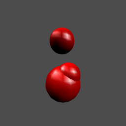

[](http://quantlet.de/index.php?p=info)

## [](http://quantlet.de/) **BCS_LightedPlots** [](http://quantlet.de/d3/ia)

```yaml

Name of Quantlet : BCS_LightedPlots

Published in : Basic Elements of Computational Statistics

Description : 'Different lighted plots for three dimensional data. The data is obtained by
univariate random normal sampling. Light sources are then alternated for the different plots to
show the effect on the appearance of the plot.'

Keywords : rgl,lighted,plot,random normal,normal,3D,marbles

Author : Polina Marchenko

Submitted : 2016-01-28, Christoph Schult

Output : Four plots for three dimensional data with different lighting.

```




```r
require(rgl)

# Define variables to plot
x = rnorm(3)
y = rnorm(3)
z = rnorm(3)

# rgl.spheres with default light
rgl.spheres(x, y, z, radius = runif(5), col = "red3", smooth = T)

# rgl.spheres without lighting
rgl.spheres(x, y, z, radius = runif(5), col = "red3", smooth = T)
rgl.clear(type = "lights")

# rgl.spheres with one light source
rgl.spheres(x, y, z, radius = runif(5), col = "red3", smooth = T)
rgl.light(theta = -90, phi = 50, ambient = "white", diffuse = "#dddddd", specular = "white")

# rgl.spheres with two light sources
rgl.spheres(x, y, z, radius = runif(5), col = "red3", smooth = T)
rgl.light(theta = 45, phi = 30, ambient = "#dddddd", diffuse = "#dddddd", specular = "white")
```
