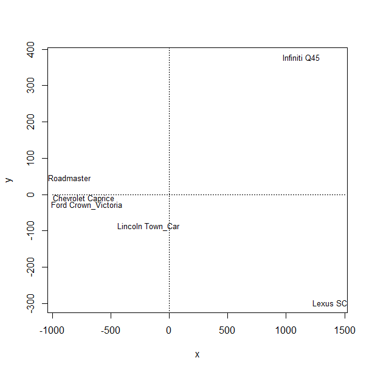

[](http://quantlet.de/)

## [](http://quantlet.de/) **BCS_MDS** [](http://quantlet.de/)

```yaml

Name of Quantlet:         'BCS_MDS'

Published in:             'Basic Elements of Computational Statistics'

Description:              'Multidimensional Scaling is performed on a subset of the data "cars93" from
                           package "MASS". First, the subset is selected, then the MDS model is fitted
                           using Euclidean distance. The result is shown in a plot.'

Keywords:                 'multidimensional, MASS, MDS, euclidean distance, plot'

Author[New]:               Johannes Haupt

Submitted:                '2016-01-28, Christoph Schult'

```



### R Code
```r


library("MASS")  # install package to get the data
data(Cars93, package = "MASS")  # load the data 
rownames(Cars93) = Cars93[, ncol(Cars93)]  # name the row after the car  model
mydata = Cars93[which(Cars93$DriveTrain == "Rear" & Cars93$MPG.city <= 18), ]  #  choose cars having rear drive train and mpg<=18

mydata = mydata[, c(5, 7, 8, 11:15, 17:19, 20:25)]  # choose only relevant (numerical) variables
mydata = na.omit(mydata)  # omit observations with missing values
d = dist(mydata, method = "euclidean")  # calculate euclidean distance matrix
fit = cmdscale(d)  # fit mds model
dev.new()
plot(fit[, 1], fit[, 2], xlab = "x", ylab = "y", type = "n")  # 3 plot the model
segments(-1000, -0, 1500, 0, lty = "dotted")  # horizontal line
segments(0, -500, 0, 500, lty = "dotted")  # vertical line
text(fit[, 1], fit[, 2], rownames(mydata), cex = 0.8)  # add text to the plot

```

automatically created on 2023-03-27