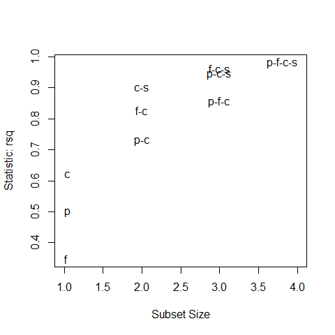

[](http://quantlet.de/)

## [](http://quantlet.de/) **BCS_MLRleaps** [](http://quantlet.de/)

```yaml

Name of Quantlet:         'BCS_MLRleaps'

Published in:             'Basic Elements of Computational Statistics'

Description:              'Perform stepwise regression on all subsets to compare the values
                           of R squared for all combinations of explanatory variables. All combinations
                           with R squared > 0.7 are shown in a plot of R squared against subsample size.'

Keywords:                 'stepwise regression, R-squared, subsamples, explanatory variables, 
                           regression analysis'

Author[New]:               Johannes Haupt

Submitted:                '2016-01-28, Christoph Schult'

Output:                   'Plot for R-squared vs. size of subsamples'

```



### R Code
```r

# install.packages("MASS")  # install package to get dataset
data(UScereal, package = "MASS")  # load the dataset

fit = lm(calories ~ protein + fat + carbo + sugars, data = UScereal)
# fit the regression model

# install.packages("leaps")  # install package for regsubsets function
library("leaps")  # load the library for regsubsets function
subset = regsubsets(calories ~ protein + fat + carbo + sugars, data = UScereal, nbest = 3)
# fit lm to all possible regresiion subsets
# install.packages("car")  # install package to plot the result
library("car")  # load package to plot the result
dev.new()
subsets(subset, statistic = "rsq")  # display result (R^2) for all regression subsets
```

automatically created on 2023-03-28