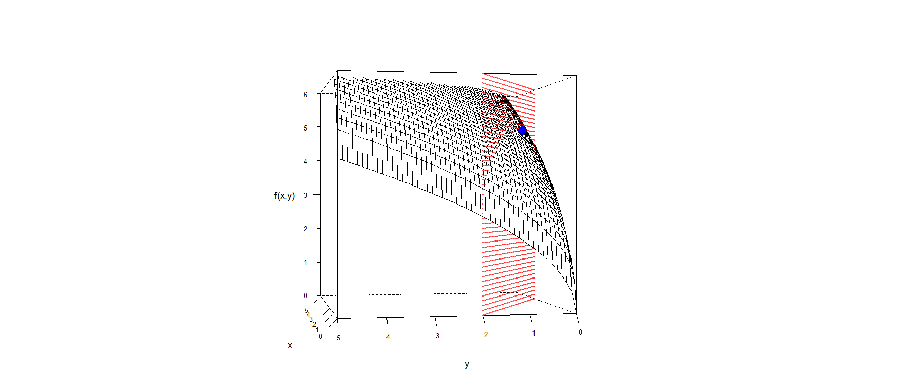

[](http://quantlet.de/)

## [](http://quantlet.de/) **BCS_NLP** [](http://quantlet.de/)

```yaml

Name of Quantlet : BCS_NLP

Published in : Basic Elements of Computational Statistics

Description : 'A 3d plot for a nonlinear progamming problem. The black hyperplane depicts the
function to be optimized. A red hyperplane depicts the constraint of the function.'

Keywords : 'Numerical optimization,optimization,3D,plot,multivariate, bivariate,BCS,numerical
methods,nonlinear programming, costrained optimization'

Author[New] : Christoph, Schult

Submitted : 2016-01-28, Christoph Schult

Output : A 3d plot of a nonlinear programming problem.

```




### R Code:
```r

x = matrix(rep(seq(0, 5, length.out = 50), 50), 50)
y = t(matrix(rep(seq(0, 5, length.out = 50), 50), 50))
z = (5 * x)^0.5 + (3 * y)^0.5

X = c(matrix(rep(seq(0, (3 + 1/3), length.out = 75), 75), 75))
Y = c(2 - 0.6 * X)
Z = c(matrix(sort(rep(seq(min(z), max(z), length.out = 75), 75)), 75))

par.set = list(axis.line = list(col = "transparent"), clip = list(panel = "off"))
names(par.set) = c("axis.line", "clip")

# Optimum
fct = function(x) {
    sqrt(5 * x[1]) + sqrt(3 * x[2])
}  # objective function
A = matrix(c(-3, -5), nrow = 1, ncol = 2, byrow = TRUE)
b = c(-10)  # vector of constraints
answer = constrOptim(c(1, 1), fct, NULL, ui = A, ci = b, control = list(fnscale = -1))
ptopt = c(answer$par, answer$value)  # optimal point

pts = rbind(cbind(X, Y, Z), ptopt)
require("lattice")
wireframe(z ~ x * y, pts = pts, shade = F, aspect = 1, scales = list(col = "black", arrows = FALSE), zlim = c(0, 6), 
    drape = F, colorkey = F, screen = list(z = 70, x = -90, y = 30), par.settings = par.set, xlab = list("x", cex = 1.2), 
    ylab = list("y", cex = 1.2), zlab = list("f(x,y)", cex = 1.2), panel.3d.wireframe = function(x, y, z, X, Y, Z, xlim, 
        ylim, zlim, xlim.scaled, ylim.scaled, zlim.scaled, pts, ...) {
        
        panel.3dscatter(x = pts[pts[, 3] <= sqrt(5 * pts[, 1]) + sqrt(3 * pts[, 2]), 1], y = pts[pts[, 3] <= sqrt(5 * 
            pts[, 1]) + sqrt(3 * pts[, 2]), 2], z = pts[pts[, 3] <= sqrt(5 * pts[, 1]) + sqrt(3 * pts[, 2]), 3], xlim = xlim, 
            ylim = ylim, zlim = zlim, xlim.scaled = xlim.scaled, ylim.scaled = ylim.scaled, zlim.scaled = zlim.scaled, 
            type = "p", pch = 19, col = rgb(1, 0.05, 0.05, alpha = 0.5), cex = 0.1, .scale = TRUE, ...)
        
        panel.3dwire(x = x, y = y, z = z, xlim = xlim, ylim = ylim, zlim = zlim, xlim.scaled = xlim.scaled, ylim.scaled = ylim.scaled, 
            zlim.scaled = zlim.scaled, ...)
        
        panel.3dscatter(x = pts[pts[, 3] >= sqrt(5 * pts[, 1]) + sqrt(3 * pts[, 2]), 1], y = pts[pts[, 3] >= sqrt(5 * 
            pts[, 1]) + sqrt(3 * pts[, 2]), 2], z = pts[pts[, 3] >= sqrt(5 * pts[, 1]) + sqrt(3 * pts[, 2]), 3], xlim = xlim, 
            ylim = ylim, zlim = zlim, xlim.scaled = xlim.scaled, ylim.scaled = ylim.scaled, zlim.scaled = zlim.scaled, 
            type = "p", pch = 19, col = rgb(1, 0.05, 0.05, alpha = 0.5), cex = 0.1, .scale = TRUE, ...)
        
        panel.3dscatter(x = pts[length(pts[, 1]), 1], y = pts[length(pts[, 1]), 2], z = pts[length(pts[, 1]), 3], xlim = xlim, 
            ylim = ylim, zlim = zlim, xlim.scaled = xlim.scaled, ylim.scaled = ylim.scaled, zlim.scaled = zlim.scaled, 
            type = "p", pch = 19, col = "blue", cex = 2, .scale = TRUE, ...)
    })
```
