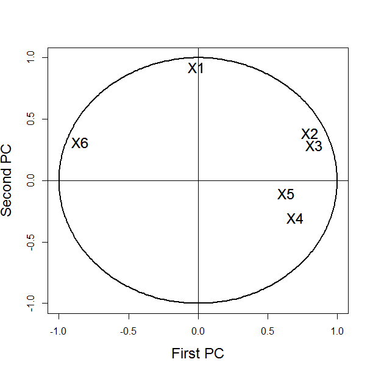

[](http://quantlet.de/)

## [](http://quantlet.de/) **BCS_NPCAbiplot** [](http://quantlet.de/)

```yaml

Name of Quantlet : BCS_NPCAbiplot

Published in : Basic Elements of Computational Statistics

Description : 'Perform normal principal component analysis (PCA) on the data "banknotes" from
package "ncomplete". Plot that correlation of the NPCs and the originial variable including the
unit circle in the plot for reference.'

Keywords : principal component analysis, banknotes, correlation, unit circle, plot

Author[New] : Anastasija Tetereva

Submitted : 2016-01-28, Christoph Schult

Output : Plot of the correlation between NPC and original variable on a unit circle.

```




### R Code:
```r
require(mclust)
data(banknote, package = "mclust")  # load the data
mydata = banknote[, -1]  # remove the last column indicating genuine/not genuine
fit = princomp(mydata, cor = TRUE)  # fit normalized PCA model

dev.new()
ucircle = cbind(cos((0:360)/180 * pi), sin((0:360)/180 * pi))

plot(ucircle, type = "l", lty = "solid", xlab = "First PC", ylab = "Second PC", cex.lab = 1.5, cex.axis = 1, cex.main = 1, 
    lwd = 2)
abline(h = 0, v = 0)
label = c("X1", "X2", "X3", "X4", "X5", "X6")
text(cor(mydata, fit$scores), label, cex = 1.5)
text(cor(mydata, fit$scores), label, cex = 1.5)
```
