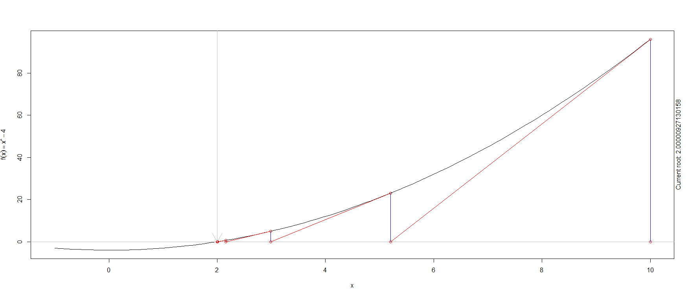

[](http://quantlet.de/index.php?p=info)

## [](http://quantlet.de/) **BCS_Newton** [](http://quantlet.de/d3/ia)

```yaml

Name of Quantlet : BCS_Newton

Published in : Basic Computational Statistics

Description : 'The code produces an inteactive plot for the illustration of the Newton-Raphson
method. In the example the univariate function f(x) = x^2 - 4 is optimized. An optimum is found, if
the first derivative of the function at this point is equal to zero. Therefore the method looks for
the root of the first derivative.'

Keywords : numerical methods,BCS,approximation,root,Newton,univariate, scatterplot

Author : Yafei, Xu

Submitted : 2016-01-28, Christoph Schult

Output : A scatterplot illustrating the Newton-Ramphsey method for the function f(x) = x^2 - 4.

```




```r
# install.packages('animation')
require(animation)  # package for illustration of newton procedure

# illustration plot for the newton method
newt = newton.method(FUN = function(x) x^2 - 4, init = 10, rg = c(-1, 10), tol = 0.001, main = "", interact = F, col.lp = c("blue", 
    "red", "red"))
# added points
newt$root  # root
newt$value  # function value at the root
```
