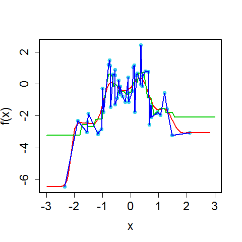

[](http://quantlet.de/)

## [](http://quantlet.de/) **BCS_NonparametricRegressions** [](http://quantlet.de/)

```yaml

Name of Quantlet : BCS_NonparametricRegressions

Published in : Basic Elements of Computational Statistics

Description : 'Multiple nonparametric regressions for DAX log-returns on FTSE log-returns. They
show how different nonparametric regressions predict the same simulated data.'

Keywords : 'splines, regression, DAX, FTSE, log-returns, estimation, plot, nonparametric,
univariate nonparametric regression, lambda, different lambdas'

Author[New] : Christoph Schult

Submitted : 2016-01-28, Christoph Schult

Output : 'One plot for multiple nonparametric regressions of the DAX log-returns on FTSE
log-returns.'

```




### R Code:
```r
# load necessary packages
require(datasets)
require(class)
require(grDevices)
require(lattice)


# function for kNN regression
knn.reg = function(x, xis, yis, k) {
    knn.reg = rep(0, times = length(x))
    for (i in 1:length(x)) {
        distances = abs(x[i] - xis)
        knn.reg[i] = mean(yis[order(distances)][1:k])
    }
    knn.reg
}


param_cex = 1.5
# set optimal k found earlier with cross validation
k_CV = 5

# set up simulated data
n = 50
Xis = rnorm(n)
Epsilon = rnorm(n)
RegressionCurve = function(x) sin(2 * pi * x) - x^2
Yis = RegressionCurve(Xis) + Epsilon

# regressions
kernel.reg.example = function(new_x) {
    ksmooth(x = Xis, y = Yis, kernel = "normal", bandwidth = 1.06 * n^(-1/5), x.points = new_x)$y
}
kNN.reg.example = function(x) knn.reg(x, Xis, Yis, k_CV)
spline.reg.example = smooth.spline(x = Xis, y = Yis)

nameChart = "BCS_NonparametricRegressions.pdf"

# plot regression results
pdf(file = nameChart, paper = "special", width = 8, height = 8)
par(cex = 1, cex.axis = 1.5, cex.lab = 1.5, lwd = 2, lty = "solid", pch = 19)
plot(Xis, Yis, xlim = c(-3, 3), col = rgb(0.1, 0.8, 0.9, alpha = 0.7), xlab = "x", ylab = "f(x)")
plot(kernel.reg.example, add = TRUE, col = 2, xlim = c(-3, 3))
plot(kNN.reg.example, add = TRUE, col = 3, xlim = c(-3, 3))
lines(spline.reg.example, col = 4, xlim = c(-3, 3))
```
