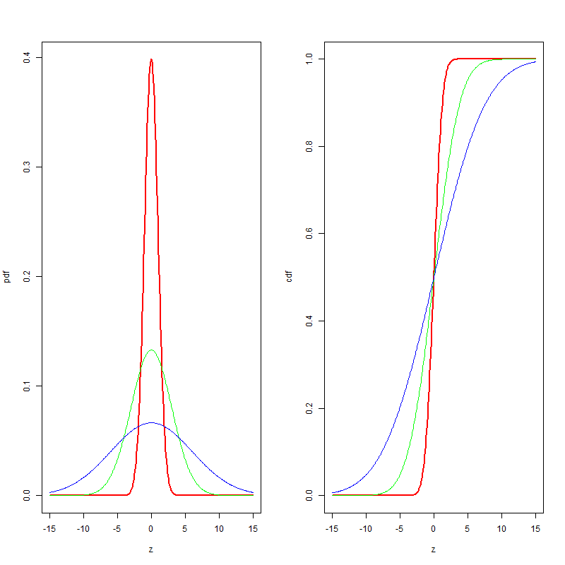

[](http://quantlet.de/)

## [](http://quantlet.de/) **BCS_NormPdfCdf** [](http://quantlet.de/)

```yaml

Name of Quantlet : BCS_NormPdfCdf

Published in : Basic Elements of Computational Statistics

Description : 'The normal distribution is very often applied in statisitics. It is a stable
distribution, which is symmetric around its mean. The standard normal distribution has an
expectaion of zero and variance equals one. Higher variance leads to flatter pdfs and cdfs.'

Keywords : 'continuous, standard, univariate, distribution, normal, pdf, cdf, stable, gauss, CLT,
gaussian'

See also : 'BCS_StablePdfCdf, BCS_ExpPdfCdf, BCS_StablePdfCdfSpecial, BCS_ChiPdfCdf, BCS_FPdfCdf,
BCS_CauchyPdfCdf, BCS_tPdfCdf'

Author : Ivan Vasylchenko, Benjamin Samulowski, Noa Tamir

Submitted : 2016-01-28, Christoph Schult

Output : 'Plots pdfs and cdfs for normal distribution with different standard deviations and zero
expectation.'

```




### R Code:
```r
par(mfrow = c(1, 2))
# creates the rv
z = seq(-15, 15, length = 400)
# different standard deviations
s = c(1, 3, 6)

# standard normal pdf
plot(z, dnorm(z, 0, s[1]), xlab = "z", ylab = "pdf", type = "l", lwd = 2, col = "red")
# s=3
lines(z, dnorm(z, 0, s[2]), col = "green")
# s=6
lines(z, dnorm(z, 0, s[3]), col = "blue")

# same order of s as above standard normal cdf
plot(z, pnorm(z, 0, 1), xlab = "z", ylab = "cdf", type = "l", lwd = 2, col = "red")
lines(z, pnorm(z, 0, s[2]), col = "green")
lines(z, pnorm(z, 0, s[3]), col = "blue")
```
