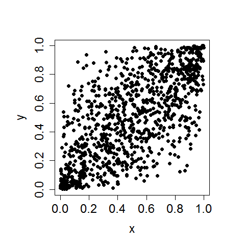
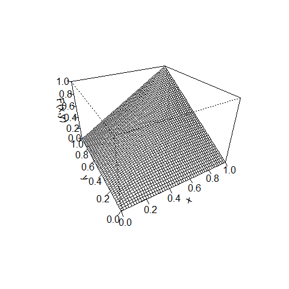
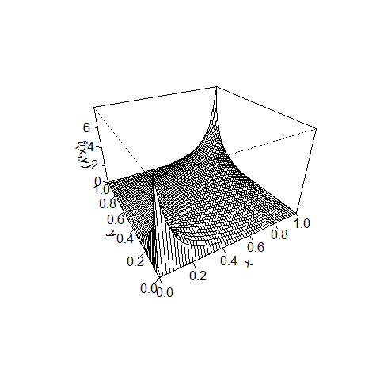
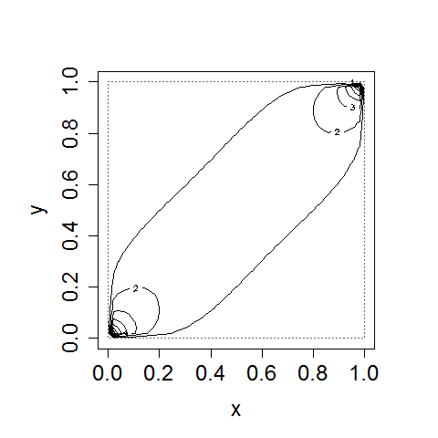

[](http://quantlet.de/index.php?p=info)

## [](http://quantlet.de/) **BCS_NormalCopula** [](http://quantlet.de/d3/ia)

```yaml

Name of Quantlet : BCS_NormalCopula

Published in : Basic Elements of Computational Statistics

Description : 'A bivariate normal distribution is created by the function normalCopula.The
normalCopula function creates copula objects and also computes joint densities and probabilities.
Both rv have a correlation of 0.7. The first plot is a standard scatterplot of the two variables. A
contour and three dimensional scatterplot illustrate the cdf of the two variables. The last two
plots depict the density functions for the rvs. One can observe the elliptical shape of the contour
lines.'

Keywords : 'multivariate,distribution,copula,gaussian,normal,density,
correlation,pdf,cdf,contour,scatterplot'

Author : Ostap Okhrin

Submitted : 2016-01-28, Christoph Schult

Output : Five plots for a binormal distribution constructed by normalCopula.

```











```r
graphics.off()
library(copula)
layout(matrix(c(1, 1, 2, 3, 4, 5), 3, 2, byrow = T), TRUE)
par(pty = "s")

# bivariate normal copula with correlation 0.7 for the 2 variables
norm.2d.cop = normalCopula(param = 0.7, dim = 2)

# scatterplot of a pseudo random sample of two variables with a joint normal distribution
plot(rCopula(1000, norm.2d.cop), pch = 19, cex.axis = 1.5, cex.lab = 1.5, xlab = "x", ylab = "y")
# draws a three dimensional scatterplot of the two rv and their joint probability
persp(norm.2d.cop, pCopula, xlab = "x", ylab = "y", zlab = "F(x,y)")

# isoprobability lines for the two rv
contour(norm.2d.cop, pCopula, cex.axis = 1.5, cex.lab = 1.5, xlab = "x", ylab = "y")

# three dimensional scatterplot of the two rv and their joint density
persp(norm.2d.cop, dCopula, xlab = "x", ylab = "y", zlab = "f(x,y)")

# isodensity lines for the two rv
contour(norm.2d.cop, dCopula, cex.axis = 1.5, cex.lab = 1.5, xlab = "x", ylab = "y")

```
