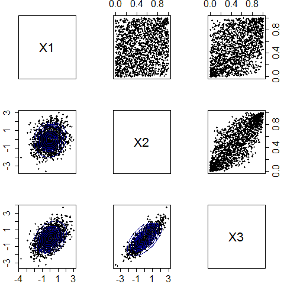

[](http://quantlet.de/index.php?p=info)

## [](http://quantlet.de/) **BCS_NormalCopulaContour** [](http://quantlet.de/d3/ia)

```yaml

Name of Quantlet : BCS_NormalCopulaContour

Published in : Basic Elements of Computational Statistics

Description : 'The trivariate normal distribution is produced by random sampling. In order to
specify the dependency between the variables, it is necessary to define the covariance matrix. The
mean vector for all three variables is also needed. The bivariate marginal distributions are
estimated by copulae.'

Keywords : 'multivariate,copula,contour,correlation,bivariate,density,
normal,matrix,distribution,pdf,cdf,scatterplot'

See also :

Author : Okhrin, Ostap

Submitted : 2016-01-28, Christoph Schult

Output : 'Bivariate marginal distributions are plotted in the upper triangle of the matrix. Contour
plots for the densities in the lower triangle.'

```




```r
library(mvtnorm)
library(copula)

# variables

sigma = matrix(c(1, 0.2, 0.5, 0.2, 1, 0.8, 0.5, 0.8, 1), nrow = 3, ncol = 3)
set.seed(3)
data = rmvnorm(1500, mean = rep(0, 3), sigma = sigma)
colnames(data) = c("X1", "X2", "X3")


X1 = data[, 1]
X2 = data[, 2]
X3 = data[, 3]


x1 = rank(X1)/(length(X1) + 1)
x2 = rank(X2)/(length(X2) + 1)
x3 = rank(X3)/(length(X3) + 1)


rhoX1X2 = cor(X1, X2, method = "kendall")
rhoX1X3 = cor(X1, X3, method = "kendall")
rhoX2X3 = cor(X2, X3, method = "kendall")


copulaX1X2 = mvdc(normalCopula(rhoX1X2), c("norm", "norm"), list(list(mean = 0, sd = 1), list(mean = 0, sd = 1)))

copulaX1X3 = mvdc(normalCopula(rhoX1X3), c("norm", "norm"), list(list(mean = 0, sd = 1), list(mean = 0, sd = 1)))
copulaX2X3 = mvdc(normalCopula(rhoX2X3), c("norm", "norm"), list(list(mean = 0, sd = 1), list(mean = 0, sd = 1)))

graphics.off()

par(mfrow = c(3, 3), pch = 20, mar = c(2.1, 2.5, 2.1, 2.5), cex.axis = 1.5)
laymat = matrix(c(1, 2, 3, 4, 5, 6, 7, 8, 9), nrow = 3, ncol = 3, byrow = T)
layout = (laymat)


# matrix of 3x3 graphics plot 1 (empty)
plot(0, xaxt = "n", yaxt = "n", pch = "", ylab = "", xlab = "", xlim = c(-1, 1), ylim = c(-1, 1))
text(0, 0, "X1", cex = 2)
# plot 2: marginal distribution of x1 and x2
plot(x1, x2, xlab = "", ylab = "", xaxt = "n", yaxt = "n")
axis(3)
# plot 3: marginal distribution of x1 and x3
plot(x1, x3, xlab = "", ylab = "", xaxt = "n", yaxt = "n")
axis(3)
axis(4)
# plot 4: contour plot for x1 and x2
plot(X1, X2, xlab = "", ylab = "", xaxt = "n")
contour(copulaX1X2, dMvdc, xlim = c(min(X1, X2), max(X1, X2)), ylim = c(min(X1, X2), max(X1, X2)), col = "darkblue", 
    lwd = 1.75, add = TRUE)

# plot 5 (empty)
plot(0, xaxt = "n", yaxt = "n", pch = "", ylab = "", xlab = "", xlim = c(-1, 1), ylim = c(-1, 1))
text(0, 0, "X2", cex = 2)

# plot 6: marginal distribution of x2 and x3
plot(x2, x3, xlab = "", ylab = "", xaxt = "n", yaxt = "n")
axis(4)
# plot 7: contour plot for x1 and x3
plot(X1, X3, xlab = "", ylab = "")
contour(copulaX1X3, dMvdc, xlim = c(min(X1, X2), max(X1, X2)), ylim = c(min(X1, X3), max(X1, X3)), col = "darkblue", 
    lwd = 1.75, add = TRUE)

# plot 8: contour plot for x2 and x3
plot(X2, X3, xlab = "", ylab = "", yaxt = "n")
contour(copulaX2X3, dMvdc, xlim = c(min(X1, X2), max(X1, X2)), ylim = c(min(X2, X3), max(X2, X3)), col = "darkblue", 
    lwd = 1.75, add = TRUE)

# plot 9 (empty)
plot(0, xaxt = "n", yaxt = "n", pch = "", ylab = "", xlab = "", xlim = c(-1, 1), ylim = c(-1, 1))
text(0, 0, "X3", cex = 2)
```
