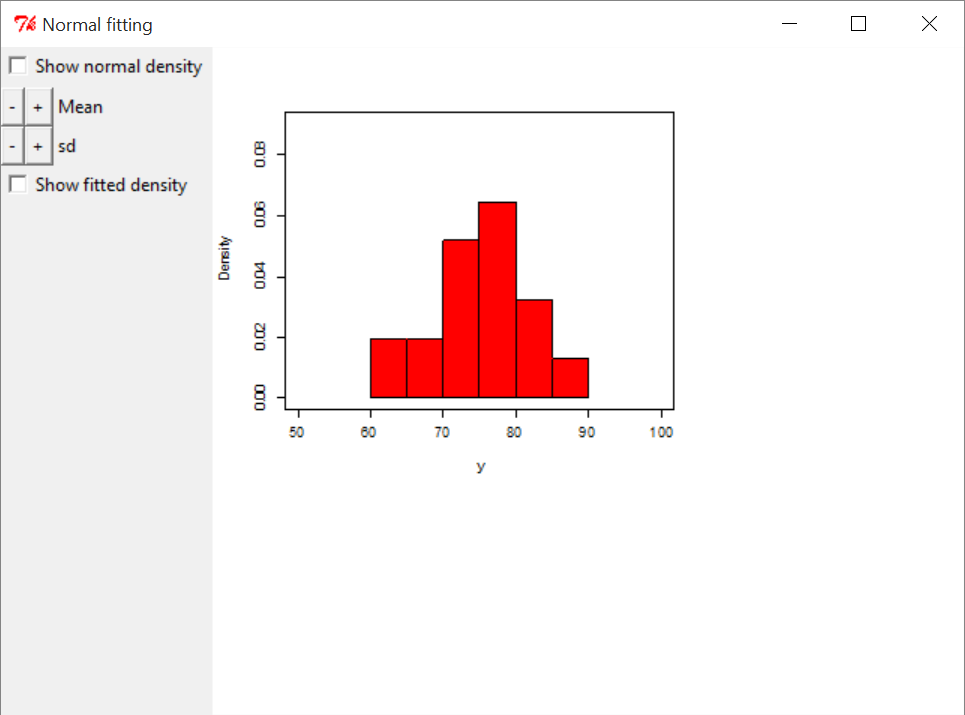

[](http://quantlet.de/index.php?p=info)

## [](http://quantlet.de/) **BCS_BivariateRegression** [](http://quantlet.de/d3/ia)

```yaml

Name of Quantlet : BCS_BivariateRegression

Published in : Basic Elements of Computational Statistics

Description : 'Histogram for the height of trees from the trees package. It is possible to display
density estimates for the height based on a assumed normal distribuion and estimated density.'

Keywords : rpanel,density estimation,histogram,density,plot

See also :

Author : Polina Marchenko

Submitted : 2016-01-28, Christoph Schult

Output : An interactive histogram with denisty estimation for the height of trees.

```




```r
# Normal density fit
require(rpanel)  # load required package
data(trees)  # load required data
attach(trees)  # attach required data
y = Height  # define y as height
rp.normal(y, panel.plot = T)  # plot interacitve histogram
```